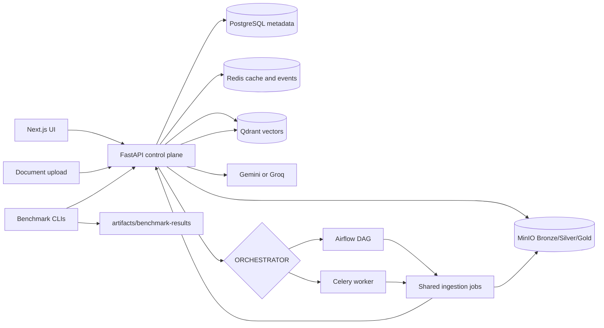

# RAGForge

> From document ingestion to grounded answers: build, trace, and evaluate the complete RAG lifecycle.

[](https://github.com/moad-cod/RAGForge/actions/workflows/frontend.yml)
[](https://github.com/moad-cod/RAGForge/actions/workflows/control-plane-e2e.yml)

RAGForge is a production-oriented RAG engineering platform for document ingestion, configurable chunking, retrieval, grounded AI chat, source tracing, and reproducible evaluation.

It is built for people who want to inspect the whole RAG system, not just demo a file upload and a chat box. The repository includes a FastAPI control plane, a Next.js UI, PostgreSQL metadata, MinIO Bronze/Silver/Gold artifacts, Qdrant vector search, Redis-backed realtime helpers, hosted LLM providers, and comparable Airflow/Celery ingestion paths.

**Strongest verified capabilities**

- Tenant-aware user and project isolation with JWT auth and project ownership checks.
- Durable file ingestion through MinIO, PostgreSQL ingestion runs, and Airflow or Celery orchestration.
- Configurable text chunking, dense embeddings, sparse BM25 vectors, and hybrid Qdrant retrieval.
- Streaming RAG answers through Gemini or Groq, with persisted query history and retrieval traces.
- Next.js control-plane UI for projects, sources, ingestion status, playground chat, observability, and settings.
- Airflow-versus-Celery ingestion benchmarking with JSON and Markdown artifacts.

**Quick links:** [Docker Quick Start](#docker-quick-start) | [Architecture](#architecture) | [Evaluation](#evaluation-and-experiments) | [Project Map](PROJECT_MAP.md) | [Backend Map](backend/BACKEND_MAP.md)

## Project Status

RAGForge is an active engineering project. The default runtime focuses on text RAG. Some heavier paths are intentionally optional or incomplete so the core stack stays practical for local development.

| Capability | Status | Notes |
| --- | --- | --- |
| Auth, projects, documents, query history | Implemented | JWT auth, ownership-scoped projects, soft deletes, durable query logs. |
| Durable file ingestion | Implemented | File upload lands raw data in MinIO Bronze, then writes Silver/Gold artifacts and Qdrant indexes. |
| Airflow ingestion orchestration | Implemented | Docker profile and DAG trigger the shared pipeline jobs. |
| Celery ingestion orchestration | Implemented | Docker profile and worker tasks run the same shared pipeline stages. |
| Dense and hybrid retrieval | Implemented | FastEmbed dense vectors plus BM25 sparse vectors in Qdrant. |
| Streaming answers | Implemented | SSE query stream emits stages and generated tokens. |
| Source tracing | Implemented | Query logs store ranked retrieval records linked back to chunks and document versions. |
| Redis query cache and ingestion events | Implemented | Best-effort cache and event replay; PostgreSQL remains authoritative. |
| Cross-encoder reranking | Experimental | Code path exists, but heavy reranker dependencies are not in the default backend requirements. |
| Multimodal PDF ingestion/query | Experimental | Uses R2 image storage and a separate multimodal collection when configured. |
| BEIR/SciFact retrieval evaluation | In progress | A SciFact config and legacy metrics exist; no verified BEIR runner command is currently documented. |
| Organization membership and roles | Planned | Organization records exist, but role/member enforcement is not complete. |
| Local generation through Ollama | Planned | Hosted Gemini/Groq generation is implemented; Ollama is not wired into the current config. |

## Screenshots And Demo

No current UI screenshot or demo video is tracked in the repository. Architecture images are available under [`docs/architecture/`](docs/architecture/), including the system design, data model, and document lifecycle diagrams.

## Why RAGForge?

Many RAG examples stop after uploading a document and asking a question. RAGForge focuses on the engineering lifecycle around that interaction:

- **Durable ingestion:** raw uploads, parsed chunks, embedded chunks, indexing state, and retries are represented as explicit records and artifacts.
- **Configurable processing:** chunkers are exposed through a backend registry and selectable from the frontend.
- **Traceable retrieval:** ranked evidence records persist query-to-chunk lineage, scores, retrieval strategy, document version, and source text.
- **Observable operations:** ingestion runs stream progress through SSE and can recover state from PostgreSQL.
- **Comparable orchestration:** Airflow and Celery use the same shared ingestion stages so their performance can be benchmarked fairly.

## Core Capabilities

### Implemented

- User registration, login, profile update, and JWT-protected API routes.
- Project CRUD with per-user ownership checks and one Qdrant collection per project.
- Document listing, document details, version history, and soft deletion.
- File ingestion for PDF, DOCX, XLSX, PPTX, CSV, HTML/HTM, Markdown, and text.
- URL and Google Drive ingestion through synchronous paths.
- Chunker registry with fixed-size, paragraph, sentence, semantic, hierarchical, late-chunking, and proposition strategies.
- MinIO Bronze/Silver/Gold object storage for durable file ingestion artifacts.
- Qdrant dense and sparse vector indexing with project/document payload filters.
- Gemini and Groq chat-completion providers through OpenAI-compatible clients.
- Query response caching, query history, retrieval trace inspection, and SSE streaming.
- Docker Compose profiles for core services, Airflow, and Celery.

### Experimental Or Optional

- Cross-encoder reranking with `cross-encoder/ms-marco-MiniLM-L-6-v2`.
- Multimodal PDF page ingestion and multimodal querying with Cloudflare R2 image storage.
- Legacy RAGAS-style evaluation scripts in `backend/evaluation/legacy/`.

### Planned Or In Progress

- Full organization membership and role authorization.
- BEIR/SciFact retrieval-quality runner for reproducible Recall, Precision, MRR, and NDCG metrics.
- Local LLM generation through Ollama or another local runtime.
- First-class experiment records exposed through the frontend.

## Architecture



**Control plane:** FastAPI owns authentication, project/document APIs, ingestion-run state, query history, retrieval logs, and internal pipeline callbacks.

**Ingestion/data plane:** File uploads land in MinIO Bronze. Airflow or Celery then runs the shared Bronze-to-Silver, Silver-to-Gold, Qdrant upsert, and finalize stages. PostgreSQL remains the authoritative state machine.

**Retrieval and generation path:** Interactive chat enters through FastAPI, embeds the question, retrieves from Qdrant with project/document filters, builds a grounded prompt, calls Gemini or Groq, streams answer tokens, and stores trace records.

**Evaluation path:** Benchmark CLIs drive public API workflows and write generated reports to `artifacts/benchmark-results/`.

## Document Ingestion Lifecycle

The complete durable path is `POST /ingest/file`.

```text
Upload
  -> validate ownership, file type, size, and chunker
  -> write raw bytes to MinIO Bronze
  -> create DocumentVersion and IngestionRun in PostgreSQL
  -> enqueue Airflow DAG or Celery chain
  -> parse and chunk into Silver Parquet
  -> embed into Gold Parquet
  -> upsert deterministic points into Qdrant
  -> update chunk lineage, version status, and ingestion status
  -> stream progress over SSE
```

URL, Google Drive, and multimodal ingestion are also present, but they do not currently provide the same full Bronze/Silver/Gold lineage as durable file ingestion.

## Query And Answer Lifecycle

```text
Question
  -> authenticate user
  -> verify project ownership and optional document scope
  -> normalize/cache lookup
  -> embed query
  -> hybrid Qdrant retrieval with payload filtering
  -> optional reranking when dependencies are available
  -> prompt construction from retrieved context
  -> Gemini or Groq generation
  -> SSE token streaming
  -> query log and retrieval trace persistence
```

Retrieval traces include rank, Qdrant score, optional rerank score, retrieval strategy, chunk ID, document ID, document version ID, chunk text, and whether the evidence was used in the answer.

## Technology Stack

| Layer | Technology | Responsibility |
| --- | --- | --- |
| Frontend | Next.js App Router, React, TypeScript | Auth pages, dashboard, project workspace, chat, history, observability. |
| Frontend data | TanStack Query, typed API helpers, SSE parser | Same-origin authenticated proxy, caching, streaming handling. |
| API/control plane | FastAPI, Pydantic, SQLAlchemy async | HTTP routes, auth, orchestration boundary, query execution. |
| Metadata database | PostgreSQL, Alembic | Users, projects, documents, versions, ingestion runs, chunks, query logs. |
| Vector database | Qdrant | Dense and sparse vectors with project/document payload filters. |
| Object storage | MinIO | Bronze raw files, Silver chunk artifacts, Gold embedded artifacts. |
| Cache/events | Redis | Best-effort query cache and replayable ingestion events. |
| Orchestration | Airflow 3.3 or Celery 5.6 | Durable file-ingestion execution. |
| Embeddings | FastEmbed, `BAAI/bge-small-en-v1.5`, BM25 sparse embeddings | Text embedding and sparse retrieval features. |
| LLM providers | Gemini, Groq | Hosted answer generation through OpenAI-compatible chat APIs. |
| Containers | Docker Compose | Local core stack plus optional Airflow and Celery profiles. |
| Testing | unittest, Vitest, Playwright, Compose config validation | Backend, frontend, integration, e2e, and benchmark checks. |

## Docker Quick Start

Requirements: Docker, Docker Compose, and a copy of `.env.example`.

```bash
cp .env.example .env
docker compose up -d --build
docker compose exec fastapi alembic upgrade head
```

Open:

- Frontend: `http://localhost:3000`
- FastAPI docs: `http://localhost:8000/docs`
- Qdrant: `http://localhost:6333/dashboard`
- MinIO console: `http://localhost:9001`

The base stack starts the frontend, FastAPI, PostgreSQL, Qdrant, MinIO, Redis, and MinIO bucket initialization. Set `GEMINI_API_KEY` or `GROQ_API_KEY` in `.env` before asking hosted-model questions.

### Airflow Profile

Use this when you want uploads to trigger the Airflow ingestion DAG.

```bash
python -c "import secrets; print(secrets.token_urlsafe(32))"
```

Set the generated value as `PIPELINE_SERVICE_TOKEN` in `.env`, then configure:

```dotenv
ORCHESTRATOR=airflow
AIRFLOW_API_URL=http://airflow-apiserver:8080
AIRFLOW_USERNAME=admin
AIRFLOW_API_JWT_SECRET=replace-with-a-random-airflow-jwt-secret
PIPELINE_SERVICE_TOKEN=replace-with-a-random-internal-token
```

Also set `AIRFLOW_PASSWORD` to the local Airflow admin password you want to use.

Start the profile:

```bash
docker compose --profile airflow up -d --build
docker compose exec fastapi alembic upgrade head
```

Open Airflow at `http://localhost:8080`.

### Celery Profile

Use this when you want uploads to trigger Celery workers instead of Airflow.

```dotenv
ORCHESTRATOR=celery
PIPELINE_SERVICE_TOKEN=replace-with-the-same-token-for-api-and-worker
```

Start the profile:

```bash
docker compose --profile celery up -d --build
docker compose exec fastapi alembic upgrade head
```

The worker entry point is:

```bash
celery -A app.workers.celery_app:celery_app worker --loglevel=INFO
```

## Local Development

### Backend

```bash
cd backend
python -m venv .venv
source .venv/bin/activate
pip install -r requirements.txt
alembic upgrade head
uvicorn app.main:app --reload
```

Development utilities:

```bash
python -m scripts.seed_control_plane --namespace development
python -m scripts.validate_control_plane
python -m scripts.reset_dev_db
```

`reset_dev_db` is destructive and intended only for local development.

### Frontend

```bash
cd frontend
npm install
npm run dev
```

The frontend talks to FastAPI through `frontend/src/app/api/backend/[...path]/route.ts`. Authentication uses an HttpOnly session cookie; JWTs are not exposed to browser JavaScript.

## Configuration

Use `.env.example` as the source of truth. Important variables:

| Group | Variable | Required | Purpose |
| --- | --- | --- | --- |
| App | `SECRET_KEY` | Yes | JWT signing secret. Generate a random value for every environment. |
| App | `FRONTEND_PORT` | No | Frontend port for Docker Compose. |
| Auth | `AUTH_COOKIE_SECURE` | Production | Set to `true` behind HTTPS. |
| PostgreSQL | `DATABASE_URL` | Yes | Main async SQLAlchemy database URL. |
| PostgreSQL tests | `TEST_DATABASE_URL`, `RUN_DATABASE_TESTS` | Optional | Enables isolated DB integration tests. |
| Qdrant | `QDRANT_URL`, `QDRANT_API_KEY` | Yes/optional | Vector database endpoint and optional API key. |
| Redis | `REDIS_URL` | Optional | Query cache and ingestion event replay. |
| Redis | `QUERY_CACHE_TTL_SECONDS`, `EVENT_STREAM_*`, `SSE_*` | Optional | Cache TTL and SSE replay/heartbeat behavior. |
| MinIO | `MINIO_ENDPOINT`, `MINIO_ACCESS_KEY`, `MINIO_SECRET_KEY` | Yes for durable file ingestion | S3-compatible artifact storage. Rotate development defaults outside local use. |
| MinIO | `MINIO_BUCKET_BRONZE`, `MINIO_BUCKET_SILVER`, `MINIO_BUCKET_GOLD` | Yes | Data-lake bucket names. |
| LLM | `GEMINI_API_KEY`, `GROQ_API_KEY` | Required per provider | Hosted generation credentials. |
| LLM | `GEMINI_BASE_URL`, `GROQ_BASE_URL`, `LLM_*` | Optional | Provider base URLs, retries, and timeout. |
| Embeddings | `EMBEDDING_BACKEND` | Optional | `fastembed` for runtime, `deterministic` for offline tests. |
| Orchestration | `ORCHESTRATOR` | Optional | `airflow`, `celery`, or disabled by using another value. |
| Airflow | `AIRFLOW_API_URL`, `AIRFLOW_USERNAME`, `AIRFLOW_PASSWORD`, `AIRFLOW_INGESTION_DAG_ID` | Required for Airflow trigger | FastAPI-to-Airflow REST trigger settings. |
| Celery | `CELERY_BROKER_URL`, `CELERY_RESULT_BACKEND`, `CELERY_TASK_*` | Required for Celery trigger | Worker broker, results, retry, eager, and prefetch settings. |
| Pipeline | `PIPELINE_SERVICE_TOKEN` | Required for orchestrated ingestion | Internal bearer token for Airflow/Celery callbacks. |
| Multimodal | `R2_ACCOUNT_ID`, `R2_ACCESS_KEY_ID`, `R2_SECRET_ACCESS_KEY`, `R2_BUCKET_NAME`, `R2_PUBLIC_URL` | Optional | Required only for `/ingest/multimodal`. |

## Usage Example

1. Start the Docker stack and run migrations.
2. Register or sign in at `http://localhost:3000`.
3. Create a project.
4. Upload a supported document and select a chunker.
5. Watch the ingestion run progress from upload through indexing.
6. Ask a question in the project playground.
7. Open citations or the retrieval trace to inspect the supporting chunks and scores.

Minimal health check:

```bash
curl http://localhost:8000/health
```

The full authenticated API is easier to explore through `http://localhost:8000/docs`.

## API Overview

Protected user endpoints require `Authorization: Bearer <JWT>`. The frontend stores that token server-side in an HttpOnly cookie and proxies requests through same-origin routes.

| Area | Routes |
| --- | --- |
| Health | `GET /health` |
| Auth | `POST /auth/register`, `POST /auth/login`, `GET/PATCH/DELETE /auth/me` |
| Organizations | `POST/GET /organizations/`, `GET/PATCH/DELETE /organizations/{organization_id}` |
| Projects | `POST/GET /projects/`, `GET/PATCH/DELETE /projects/{project_id}` |
| Documents | `GET /documents/?project_id=...`, `GET /documents/{document_id}`, `GET /documents/{document_id}/versions`, `DELETE /documents/{document_id}` |
| Chunkers | `GET /chunkers` |
| Ingestion | `POST /ingest/file`, `POST /ingest/url`, `POST /ingest/gdrive`, `POST /ingest/multimodal` |
| Ingestion runs | `GET /ingest/runs`, `GET /ingest/runs/{id}`, `POST /ingest/runs/{id}/retry`, `GET /ingest/runs/{id}/events` |
| RAG | `POST /rag/query`, `POST /rag/query/stream`, `POST /rag/multimodal-query` |
| Observability | `GET /rag/projects/{project_id}/history`, `GET /rag/queries/{query_log_id}` |
| Internal pipeline | `/internal/pipeline/*` routes protected by `PIPELINE_SERVICE_TOKEN` |

## Evaluation And Experiments

RAGForge separates tests from experiments:

```text
backend/tests/
  verifies implementation correctness

backend/evaluation/
  contains benchmark runners, configs, metrics, and legacy evaluation scripts

artifacts/benchmark-results/
  stores generated benchmark reports
```

### Airflow Versus Celery Benchmark

These CLIs drive the real FastAPI ingestion endpoint, wait for ingestion runs to finish, validate API-visible gates, and write JSON plus Markdown reports.

Airflow:

```bash
PYTHONPATH=backend backend/.venv/bin/python -m evaluation.airflow_benchmark.cli \
  --api-url http://localhost:8000 \
  --documents 10 \
  --concurrency 2 \
  --chunker paragraph
```

Celery:

```bash
PYTHONPATH=backend backend/.venv/bin/python -m evaluation.celery_benchmark.cli \
  --api-url http://localhost:8000 \
  --documents 10 \
  --concurrency 2 \
  --chunker paragraph
```

Reports are written to:

```text
artifacts/benchmark-results/airflow/
artifacts/benchmark-results/celery/
```

The benchmark config at [`backend/evaluation/configs/airflow_vs_celery.yaml`](backend/evaluation/configs/airflow_vs_celery.yaml) tracks ingestion metrics such as end-to-end latency, queue waiting time, processing time, throughput, success rate, recovery time, retry overhead, duplicate processing rate, and scaling efficiency.

### Retrieval Evaluation

[`backend/evaluation/configs/scifact.yaml`](backend/evaluation/configs/scifact.yaml) declares a BEIR/SciFact retrieval-evaluation target with Recall, Precision, MRR, and NDCG metrics. The repository does not currently include a verified BEIR runner command, so this is documented as in progress rather than a completed experiment workflow.

Airflow/Celery benchmarks measure orchestration behavior. BEIR-style evaluation measures retrieval quality. Answer-generation evaluation is a separate concern.

## Testing

### Backend

Run from `backend/` after installing `requirements.txt`:

```bash
PYTHONPATH=. .venv/bin/python -m unittest discover -s tests/unit -v
PYTHONPATH=. .venv/bin/python -m unittest discover -s tests/integration -v
PYTHONPATH=. .venv/bin/python -m unittest discover -s tests/benchmarks -v
```

Database-backed integration tests require an isolated test database:

```bash
RUN_DATABASE_TESTS=1 PYTHONPATH=. .venv/bin/python -m unittest discover -s tests/integration/postgres -v
```

End-to-end control-plane test:

```bash
make e2e-v2
```

### Frontend

Run from `frontend/`:

```bash
npm run lint
npm run test
npm run typecheck
npm run build
npm run test:e2e
```

### Compose Validation

Run from the repository root:

```bash
docker compose config
docker compose --profile airflow config
docker compose --profile celery config
docker compose -f docker-compose.yml -f docker-compose.e2e.yml --profile airflow config
```

## Security And Tenant Isolation

Current enforced boundaries:

- JWT authentication for protected user routes.
- Password hashing with bcrypt.
- Project and document access checks based on the authenticated user's owned projects.
- Query authorization before retrieval and generation.
- Qdrant payload filters for project and optional document scope.
- Project-specific Qdrant collection names.
- Tenant-aware MinIO artifact paths containing organization, project, document, and version identifiers.
- Separate internal pipeline bearer token for Airflow/Celery callbacks.
- HttpOnly cookie handling in the frontend proxy.

Current limitation: organization CRUD and `organization_id` fields exist, but organization membership and role authorization are not fully enforced. The accurate description today is tenant-aware user and project isolation, not full organization-based multi-tenancy.

## Project Structure

```text
.
|-- backend/
|   |-- app/
|   |   |-- api/                 # FastAPI routers
|   |   |-- core/                # settings, auth, database
|   |   |-- models/              # SQLAlchemy control-plane models
|   |   |-- repositories/        # PostgreSQL data access
|   |   |-- services/            # parsing, chunking, storage, retrieval, orchestration
|   |   `-- workers/             # Celery app and ingestion tasks
|   |-- airflow/                 # Airflow image, DAGs, plugins
|   |-- alembic/                 # database migrations
|   |-- evaluation/              # benchmark CLIs, configs, metrics, legacy scripts
|   |-- jobs/                    # shared ingestion pipeline stages
|   |-- scripts/                 # development and validation CLIs
|   `-- tests/                   # unit, integration, e2e, benchmark tests
|-- frontend/
|   `-- src/                     # Next.js app, components, hooks, lib, tests
|-- docs/                        # architecture, research, reports, plans
|-- artifacts/                   # generated benchmark/test outputs
|-- scripts/                     # repository-level helper scripts
|-- docker-compose.yml
|-- docker-compose.e2e.yml
|-- Makefile
|-- PROJECT_MAP.md
`-- README.md
```

## Roadmap

- Enforce organization membership and role-based authorization.
- Add a verified BEIR/SciFact retrieval runner and artifact format.
- Expose experiment records and comparisons through backend APIs and the frontend.
- Add local generation support, such as Ollama, behind explicit configuration.
- Add current UI screenshots or a short demo video to the repository.
- Package optional multimodal/reranker dependencies into separate install profiles or images.
- Harden production deployment docs for TLS, secrets, backups, and object-store credentials.

## Contributing

1. Read [`PROJECT_MAP.md`](PROJECT_MAP.md), [`backend/BACKEND_MAP.md`](backend/BACKEND_MAP.md), and [`frontend/FRONTEND_MAP.md`](frontend/FRONTEND_MAP.md) before making broad changes.
2. Keep API, frontend, pipeline, and evaluation behavior aligned with the existing maps.
3. Prefer focused tests for the code path you change.
4. Do not commit generated benchmark outputs unless they are intentionally being preserved as reference artifacts.

## License

No license file is currently present in the repository. Add a license before publishing, distributing, or reusing this project outside its current owner-controlled context.
