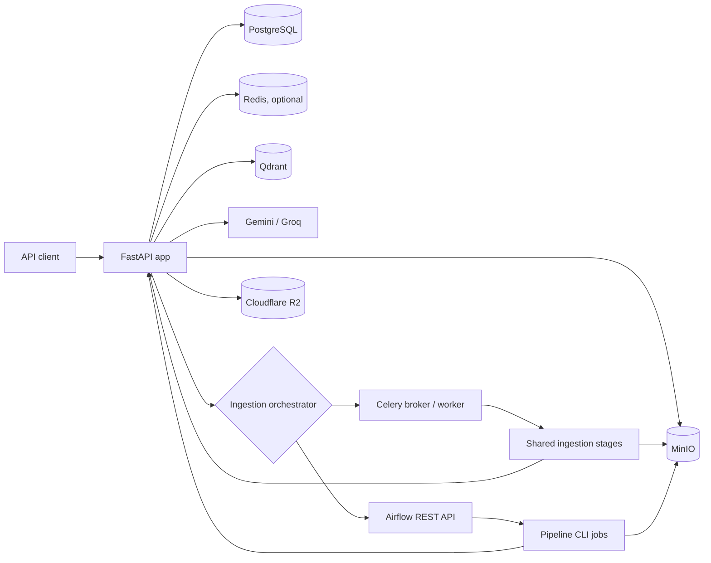
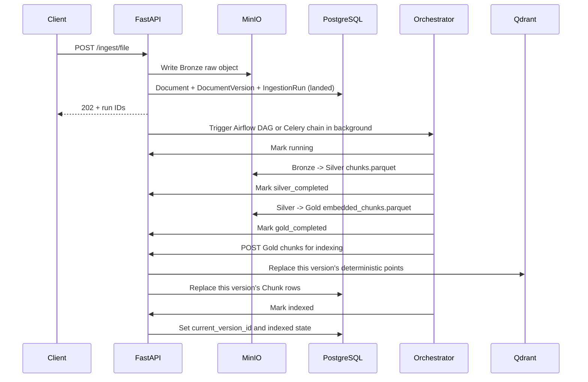
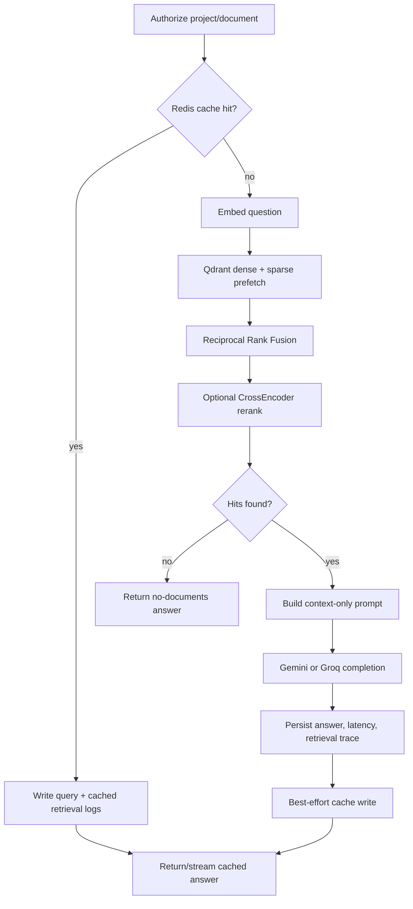
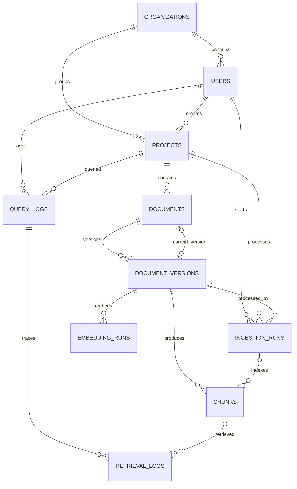

# RAGForge Backend Map

This document is a code-level map of the backend as it exists in this repository. It is intended to help a new contributor answer four questions quickly:

1. Where does a request enter the system?
2. Which service owns each part of ingestion and retrieval?
3. Where is state stored, and which state is authoritative?
4. Which paths are the current durable control-plane paths versus older synchronous paths?

## 1. System at a glance

RAGForge is a FastAPI RAG backend with a durable PostgreSQL control plane and several data-plane integrations:

- **FastAPI** exposes authentication, project/document management, ingestion, query, history, and internal pipeline APIs.
- **PostgreSQL** is the source of truth for users, projects, document versions, ingestion state, chunk lineage, and query/retrieval logs.
- **MinIO** stores versioned Bronze (raw), Silver (chunked Parquet), and Gold (embedded Parquet) artifacts for batch file ingestion.
- **Airflow or Celery** orchestrates the Bronze -> Silver -> Gold -> Qdrant file-ingestion pipeline through a small FastAPI-side orchestrator boundary.
- **Qdrant** stores dense and sparse vectors for retrieval. Each project gets its own collection.
- **Redis** is optional and best-effort. It provides query-result caching and replayable ingestion events; PostgreSQL remains authoritative.
- **Gemini or Groq** generates text answers through OpenAI-compatible chat-completion APIs.
- **Cloudflare R2** stores rendered page images for the optional multimodal PDF path.



The main application entry point is `app/main.py`. It creates the FastAPI application, mounts every router, and provides `GET /health`.

## 2. Repository layout

| Path | Responsibility |
| --- | --- |
| `app/main.py` | FastAPI app construction and router registration. |
| `app/api/` | HTTP request schemas, authorization checks, endpoint orchestration, and response shaping. |
| `app/core/` | Environment settings, async SQLAlchemy engine/session, and JWT decoding. |
| `app/models/` | SQLAlchemy control-plane models and lifecycle status constants. |
| `app/repositories/` | Reusable async PostgreSQL operations. Repository functions flush but usually leave commit ownership to the caller. |
| `app/services/` | Parsing, embedding, indexing, retrieval, caching, event streaming, artifact transformation, and integration clients. |
| `app/services/chunkers/` | Chunking algorithms and the public chunker registry. |
| `app/services/retrieval/` | Hybrid dense/sparse retrieval, optional reranking, and shared result types. |
| `jobs/` | Shared ingestion workflow stages plus container-safe CLI commands used by the orchestration layer. |
| `airflow/dags/` | The ingestion DAG and task ordering. |
| `airflow/plugins/` | Airflow-to-control-plane callbacks. |
| `evaluation/airflow_benchmark/` | Airflow ingestion benchmark runner, client, validation, and report writers. |
| `evaluation/celery_benchmark/` | Celery ingestion benchmark runner, client, validation, and report writers. |
| `alembic/` | Authoritative database migrations. |
| `tests/` | Unit/integration coverage plus an environment-driven end-to-end suite. |
| `Dockerfile` | Python 3.12 FastAPI image. |
| `airflow/Dockerfile` | Airflow 3.3 image with pipeline dependencies. |
| `worker.py` | Celery worker entry point (`celery -A worker worker --loglevel=INFO`). |
| `requirements.txt` | Default text-RAG API dependencies, including Celery. Heavy multimodal/reranker packages are deliberately excluded. |

## 3. HTTP API map

All protected user endpoints use `Authorization: Bearer <JWT>`. Login uses OAuth2 form fields (`username` contains the email, plus `password`). Internal pipeline endpoints use a separate bearer service token.

### Public endpoints

| Method | Route | Purpose |
| --- | --- | --- |
| `GET` | `/health` | Process health check; returns `{"status": "ok"}`. |
| `POST` | `/auth/register` | Register a user, optionally attached to an existing organization. |
| `POST` | `/auth/login` | Validate credentials and return a seven-day HS256 JWT. |

### Current-user and organization endpoints

| Method | Route | Purpose |
| --- | --- | --- |
| `GET` | `/auth/me` | Return the authenticated, non-deleted user. |
| `PATCH` | `/auth/me` | Change email, password, name, or organization. |
| `DELETE` | `/auth/me` | Soft-delete the user and their projects; delete their Qdrant collections. |
| `POST` | `/organizations/` | Create an organization. |
| `GET` | `/organizations/` | List all non-deleted organizations. |
| `GET` | `/organizations/{organization_id}` | Fetch an organization. |
| `PATCH` | `/organizations/{organization_id}` | Rename an organization. |
| `DELETE` | `/organizations/{organization_id}` | Soft-delete an organization. |

Organization routes require authentication but currently do not enforce organization membership or an admin role.

### Project and document endpoints

| Method | Route | Purpose |
| --- | --- | --- |
| `POST` | `/projects/` | Create an owner-scoped project and reserve a `project_<uuid>` Qdrant collection name. |
| `GET` | `/projects/` | List projects created by the current user. |
| `GET` | `/projects/{project_id}` | Fetch an owned project. |
| `PATCH` | `/projects/{project_id}` | Rename a project without changing its Qdrant collection. |
| `DELETE` | `/projects/{project_id}` | Soft-delete project/documents and delete text and multimodal collections. |
| `GET` | `/documents/?project_id=...` | List non-deleted documents in an owned project. |
| `GET` | `/documents/{document_id}` | Fetch an owned document. |
| `GET` | `/documents/{document_id}/versions` | List all versions of an owned document in ascending version order. |
| `DELETE` | `/documents/{document_id}` | Delete its text vectors and soft-delete the document. |

Project/document tenancy is ownership-based (`Project.created_by`), not organization-role-based.

### Ingestion endpoints

| Method | Route | Purpose |
| --- | --- | --- |
| `GET` | `/chunkers` | Return public chunker metadata for the frontend. |
| `POST` | `/ingest/file` | Durable file landing endpoint. Upload raw bytes to MinIO, create a document version and ingestion run, then optionally trigger the selected orchestrator. Returns `202`. |
| `GET` | `/ingest/runs?project_id=...` | List recent owned ingestion runs (limit 1-100). |
| `GET` | `/ingest/runs/{ingestion_run_id}` | Read durable run state and stage progress. |
| `POST` | `/ingest/runs/{ingestion_run_id}/retry` | Reset a failed run to queued and optionally trigger the selected orchestrator again. |
| `GET` | `/ingest/runs/{ingestion_run_id}/events` | SSE ingestion progress with Redis replay and PostgreSQL recovery. Supports `Last-Event-ID`. |
| `POST` | `/ingest/url` | Fetch, parse, chunk, embed, and index a public URL synchronously. |
| `POST` | `/ingest/gdrive` | Fetch a Drive file using the supplied access token and index it synchronously. |
| `POST` | `/ingest/multimodal` | Render and embed PDF pages, upload images to R2, and index a separate multimodal collection synchronously. |

Supported `/ingest/file` formats are PDF, DOCX, XLSX, PPTX, CSV, HTML/HTM, Markdown, and plain text. Upload size is capped by `MAX_UPLOAD_BYTES`.

### Query and observability endpoints

| Method | Route | Purpose |
| --- | --- | --- |
| `POST` | `/rag/query` | Run a synchronous text RAG query. |
| `POST` | `/rag/query/stream` | Stream query stages and generated tokens over SSE. |
| `POST` | `/rag/multimodal-query` | Retrieve PDF page images from the multimodal collection and ask Gemini a vision question. |
| `GET` | `/rag/projects/{project_id}/history` | List durable query history for an owned project. |
| `GET` | `/rag/queries/{query_log_id}` | Return a query plus its ranked retrieval trace and PostgreSQL chunk metadata. |

`QueryRequest` accepts:

- `question` and `project_id` (required)
- `provider`: `gemini` (default) or `groq`
- `model`: optional provider-specific override
- `document_id`: optional retrieval filter
- `use_parent_context`: retrieve children but replace them with parent text when available
- `include_context`: include retrieved text in the response; `DEBUG_RETURN_CONTEXT` can force this globally

### Internal pipeline endpoints

These routes require `Authorization: Bearer ${PIPELINE_SERVICE_TOKEN}` and are intended for Airflow, Celery, and pipeline jobs, not browser users.

| Method | Route | Purpose |
| --- | --- | --- |
| `GET` | `/internal/pipeline/ingestion-runs/{id}` | Return run lineage plus artifact/parser/chunker metadata. |
| `PATCH` | `/internal/pipeline/ingestion-runs/{id}` | Apply a validated status transition and publish an ingestion event. |
| `POST` | `/internal/pipeline/ingestion-runs/{id}/chunks/index` | Idempotently write Gold chunks to Qdrant and PostgreSQL. |

## 4. Durable file-ingestion flow

`POST /ingest/file` is the complete control-plane path.



### Landing phase (`app/api/ingest.py`)

1. Verify the caller owns the project.
2. Validate the file extension/MIME type and chunker.
3. Read the upload and enforce `MAX_UPLOAD_BYTES`.
4. Find or create the logical document by `(project_id, filename, source_type)`.
5. Reject duplicate content for that document using SHA-256.
6. Allocate the next version number.
7. Upload the raw object to MinIO's Bronze bucket.
8. Insert a `DocumentVersion` with status `landed` and null Silver/Gold paths.
9. Insert an `IngestionRun` with status `landed`.
10. Commit, publish a best-effort event, return `202`, and trigger `app/services/ingestion_orchestrator.py` as a background task when configured.

The object layout is deterministic and tenant-aware:

```text
bronze/org_id=<org-or-none>/project_id=<project>/document_id=<document>/version=<n>/raw/<filename>
silver/org_id=<org-or-none>/project_id=<project>/document_id=<document>/version=<n>/chunks.parquet
gold/org_id=<org-or-none>/project_id=<project>/document_id=<document>/version=<n>/embedded_chunks.parquet
```

If MinIO succeeds but the SQL transaction fails, the endpoint attempts to delete the just-landed Bronze object.

### Orchestrator boundary (`app/services/ingestion_orchestrator.py`)

File ingestion no longer imports Airflow directly. `app/api/ingest.py` calls `ingestion_orchestration_enabled()` before scheduling a background enqueue and then calls `enqueue_ingestion(run.id)`. The boundary selects the implementation from `ORCHESTRATOR`:

| Value | Behavior |
| --- | --- |
| `airflow` | Trigger `app/services/airflow.py` when `AIRFLOW_API_URL` is configured. |
| `celery` | Trigger `app/services/celery_ingestion.py` when `CELERY_BROKER_URL` or eager mode is configured. |
| anything else | Do not trigger an external orchestrator; the run remains durable in PostgreSQL. |

PostgreSQL remains the durable state machine in both modes. The UI and public API continue to read `/ingest/runs/{id}` and `/ingest/runs/{id}/events`, not Airflow or Celery's native state stores.

### Shared ingestion stages (`jobs/ingestion_workflow.py`)

The Celery path uses shared Python stage functions:

1. `detect_ingestion_plan`: load run metadata, validate the starting state, read the backend-owned ingestion plan, and mark the run `running`.
2. `bronze_to_silver_stage`: run the Bronze -> Silver transform and record the returned Silver path.
3. `silver_to_gold_embed_stage`: run the Silver -> Gold transform and record the returned Gold path.
4. `upsert_qdrant_stage`: read Gold chunks and submit them to the internal control-plane indexing endpoint.
5. `finalize_ingestion_stage`: mark the run `indexed`.

The same stage boundaries are used for the Airflow-vs-Celery comparison. The Celery implementation does not collapse the pipeline into one monolithic task.

### Airflow orchestration (`airflow/dags/ragforge_ingestion.py`)

The unscheduled `ragforge_ingestion` DAG permits four active runs and gives tasks two retries with ten-second delays. Its tasks are strictly ordered:

1. `detect_ingestion_technique`: validate the starting state, read the backend-owned ingestion plan, log the selected technique/profile, and mark the run `running`.
2. `bronze_to_silver`: select the profile-specific command when configured, otherwise run `RAGFORGE_BRONZE_TO_SILVER_CMD`; record the returned Silver path.
3. `silver_to_gold_embed`: select the profile-specific command when configured, otherwise run `RAGFORGE_SILVER_TO_GOLD_CMD`; record the Gold path.
4. `upsert_qdrant`: select the profile-specific command when configured, otherwise run `RAGFORGE_UPSERT_QDRANT_CMD`.
5. `update_postgres_status`: mark the run `indexed`.

The in-repository Bronze-to-Silver implementation is a regular Python/pyarrow CLI job, not a Spark implementation. Each configured command must print a JSON object as its final non-empty stdout line.

`app/services/ingestion_planner.py` derives one of five profiles from the selected chunker's registry capabilities:

| Profile | Techniques | Optimization |
| --- | --- | --- |
| `throughput` | fixed-size, paragraph, sentence | Large embedding batches and high parallelism hints. |
| `structured` | hierarchical | Moderate batches for parent/child-shaped workloads. |
| `embedding_aware` | semantic, late chunking | Bounded batches and serial worker hints to control model memory. |
| `llm_enriched` | proposition | Small batches and serial/network hints to respect provider rate limits. |
| `multimodal` | multimodal source/chunker | GPU hint and very small page batches; reserved for a future durable multimodal run because the current multimodal endpoint is synchronous. |

The plan is returned by the internal run endpoint, passed between Airflow tasks in XCom, and injected into job subprocesses as environment hints. A deployment can provide profile-specific stage commands (for example `RAGFORGE_SILVER_TO_GOLD_EMBEDDING_AWARE_CMD`); the generic command remains the fallback.

`airflow/plugins/ragforge_control_plane.py` records task statuses through the internal FastAPI API and marks the run failed from Airflow's failure callback.

### Celery orchestration (`app/services/celery_ingestion.py`)

The Celery implementation builds this chain:

```python
chain(
    detect_ingestion_plan_task.s(ingestion_run_id),
    bronze_to_silver_task.s(),
    silver_to_gold_task.s(),
    upsert_qdrant_task.s(),
    finalize_ingestion_task.s(),
)
```

`app/services/celery_app.py` configures the Celery application with late acknowledgements, worker-lost rejection, started tracking, result extension, a configurable prefetch multiplier, and optional eager mode. `worker.py` exposes the app as the worker entry point.

Each task wraps one shared stage from `jobs/ingestion_workflow.py`. Stage failures retry according to `CELERY_TASK_MAX_RETRIES` and `CELERY_TASK_RETRY_DELAY_SECONDS`. When the final retry is exhausted, Celery attempts to mark the durable ingestion run `failed` through the internal control-plane API.

Celery stores its workflow ID in the existing `IngestionRun.airflow_dag_run_id` field for now. That preserves schema compatibility during the comparison branch, but the field name is Airflow-specific.

### Artifact transforms (`app/services/pipeline_artifacts.py`)

- **Bronze -> Silver:** read raw bytes, parse by file type, run the selected chunker, and write Zstandard-compressed Parquet.
- **Silver schema:** chunk index, text, content hash, optional token/page/section fields, JSON metadata, and an optional precomputed dense vector.
- **Silver -> Gold:** embed chunks with `BAAI/bge-small-en-v1.5` in plan-sized batches, append a `dense_vector`, and write Gold Parquet.
- **Late chunking optimization:** preserve the contextual vectors calculated while choosing late-chunk boundaries and reuse them in Gold instead of loading the model and embedding the chunks a second time.
- **Gold -> index payload:** read Gold, deserialize metadata, and submit chunks to the control-plane indexing endpoint.

The pipeline currently accepts only `BAAI/bge-small-en-v1.5` as its artifact embedding model.

### Idempotent chunk indexing (`app/services/chunk_indexing.py`)

For durable file ingestion, chunk and point identities are UUIDv5 values derived from `document_version_id:chunk_index`:

- a deterministic PostgreSQL `Chunk.id`
- a separate deterministic Qdrant point ID
- a readable lineage ID in the Qdrant payload

Indexing validates non-empty text, unique indexes, unique content hashes, and a consistent vector size. It computes sparse BM25 vectors, deletes existing Qdrant points for the version, upserts dense+sparse points, then replaces that version's PostgreSQL chunk rows. Because IDs are deterministic, retrying the same version is safe.

Qdrant is written before the SQL rows. A SQL failure can therefore leave Qdrant ahead temporarily, but retrying repairs the mismatch.

## 5. Synchronous and multimodal ingestion paths

Three paths predate or bypass the durable batch pipeline:

### URL and Google Drive

`/ingest/url` and `/ingest/gdrive` parse, chunk, embed, and write to Qdrant during the HTTP request. They then create an already-`indexed` `DocumentVersion`.

These direct points use random UUIDs and carry project/document/chunk metadata, but they do **not** create PostgreSQL `Chunk` rows or `IngestionRun` rows. Consequently, query/retrieval history is durable, but retrieval trace rows from these points cannot link back to PostgreSQL chunk lineage.

The version's Bronze/Silver/Gold path fields are populated by the common version helper even though these synchronous paths do not actually write those artifacts.

### Multimodal PDF

`/ingest/multimodal`:

1. Requires PDF input and complete R2 configuration.
2. Renders each page with PyMuPDF, capped by `MAX_MULTIMODAL_PAGES`.
3. Lazily loads ColQwen2 and embeds each page as a multi-vector.
4. Uploads page PNGs to `pages/<document_id>/page_<n>.png` in R2.
5. Writes points to `<project_collection>_multimodal` in Qdrant.
6. Creates an already-indexed document version without an ingestion run.

`/rag/multimodal-query` embeds the question with ColQwen2, retrieves three page images, and sends those public image URLs to `gemini-2.5-flash`.

The default Docker image does not install PyTorch or `colpali_engine`; multimodal support requires a separate/heavier runtime profile as noted in `requirements.txt`.

## 6. Query flow

The primary implementation is `_execute_query()` in `app/api/query.py`.



### Retrieval

1. Dense query embedding comes from FastEmbed BGE-small (or the deterministic test backend).
2. `retriever.search()` defaults to hybrid search.
3. Qdrant prefetches up to 30 dense and 30 sparse matches under the project/document filter.
4. Qdrant combines them with reciprocal rank fusion (RRF).
5. The top results are optionally reranked by `cross-encoder/ms-marco-MiniLM-L-6-v2`.
6. If `sentence_transformers` is not installed, reranking degrades to the existing order without failing.
7. Five hits are returned by default.

For hierarchical points, `use_parent_context=true` searches child points and replaces each selected child's text with its parent text, deduplicated by parent ID.

### Generation

The prompt instructs the provider to answer only from retrieved context and say it does not know when the answer is absent. Both provider integrations use the OpenAI Python client with provider-specific base URLs:

- Gemini default: `gemini-2.5-flash`
- Groq default: `llama-3.3-70b-versatile`

The synchronous endpoint returns the completed answer. The streaming endpoint requests provider streaming and emits individual `query.token` events.

### Durable observability

Every authorized text query that passes the initial project/document check creates a `QueryLog`, including cache hits and downstream failures. Successful retrievals create ranked `RetrievalLog` rows. The final answer, latency, route (`rag` or `rag-stream`), cache status, provider, and model are persisted.

`GET /rag/queries/{id}` joins retrieval logs to PostgreSQL chunks/documents when lineage exists, exposing source document/version, chunk index/text, section/page metadata, vector score, rerank score, rank, strategy, and whether the chunk was used in the answer.

### Cache

The optional Redis cache key includes project, normalized-question hash, provider, model, document filter, and parent-context flag. Cached entries contain the answer and retrieval-hit metadata and expire after `QUERY_CACHE_TTL_SECONDS`.

Cache failures are logged and ignored. There is currently no explicit cache invalidation when project content changes, so freshness depends on the TTL.

## 7. Realtime event behavior

### Ingestion SSE

`app/services/event_stream.py` maps durable statuses to frontend event names and stages. Redis Streams retain a bounded, expiring replay log when Redis is configured. The SSE endpoint:

- emits an initial PostgreSQL snapshot;
- replays Redis events after `Last-Event-ID` when possible;
- polls PostgreSQL to recover missed/unavailable events;
- sends heartbeat comments;
- stops on `indexed`, `failed`, or `cancelled`.

Redis event publication is best-effort; losing Redis does not lose authoritative ingestion state.

### Query SSE

The query stream uses an in-process `asyncio.Queue`, not Redis. Events include received, embedding, retrieving, reranking, generating, token, completed, and failed states. A dedicated SQL session performs the work in a retained background task, so disconnecting the browser does not cancel durable query logging or provider work. Query events are not replayable after disconnect.

## 8. PostgreSQL control-plane model



| Model/table | Key meaning |
| --- | --- |
| `Organization` / `organizations` | Optional grouping for users/projects. Soft-deleted. |
| `User` / `users` | Login identity, bcrypt password hash, optional organization. Soft-deleted. |
| `Project` / `projects` | Owner-scoped RAG workspace with a unique Qdrant collection. Soft-deleted. |
| `Document` / `documents` | Logical source within a project. Tracks source type, current version, and lifecycle. Soft-deleted. |
| `DocumentVersion` / `document_versions` | Immutable content identity and version number plus artifact, parser, chunker, model, status, and error metadata. |
| `IngestionRun` / `ingestion_runs` | One pipeline attempt for a specific document version, including timestamps and a legacy `airflow_dag_run_id` orchestration ID field used by both Airflow and Celery in the current branch. |
| `Chunk` / `chunks` | Durable text and Qdrant lineage for batch-indexed Gold chunks. |
| `EmbeddingRun` / `embedding_runs` | Embedding progress model and repository support; not currently created by the active API/orchestrator flow. |
| `QueryLog` / `query_logs` | Durable question, answer, provider/model, latency, cache, route, and optional evaluation scores. |
| `RetrievalLog` / `retrieval_logs` | Ranked retrieval evidence, scores, strategy, and optional link to a durable chunk. |

Important uniqueness rules include user email, project collection, `(document, version_number)`, `(document, content_hash)`, `(version, chunk_index)`, `(version, chunk content_hash)`, Qdrant point ID, and `(version, embedding_model)`.

### Lifecycle states

Document states:

```text
uploaded | landed | processing | chunked | embedded | indexed | failed | deleted
```

Ingestion-run states and normal forward path:

```text
landed -> queued -> running -> silver_completed -> gold_completed -> indexed
                         \-> failed/cancelled from non-terminal stages
```

`app/repositories/ingestion_runs.py` enforces allowed transitions. It also maps run status to document/version status:

| Run | Document/version |
| --- | --- |
| `landed`, `queued` | `landed` |
| `running` | `processing` |
| `silver_completed` | `chunked` |
| `gold_completed` | `embedded` |
| `indexed` | `indexed` and make version current |
| `failed`, `cancelled` | `failed` |

Embedding-run states are `queued`, `running`, `completed`, `failed`, and `cancelled`.

## 9. Service/module map

### Core and persistence

| File | Responsibility |
| --- | --- |
| `app/core/config.py` | Pydantic environment settings and provider/R2 validation. |
| `app/core/db.py` | Async SQLAlchemy engine, session factory, declarative base, and FastAPI dependency. |
| `app/core/auth.py` | Decode HS256 JWT and expose `user_id`; database existence/soft-delete checks occur in endpoint code. |
| `app/models/statuses.py` | Canonical status values, SQL check expression helper, and model-level validation. |
| `app/repositories/projects.py` | Project creation, ownership lookup/listing, and rename. |
| `app/repositories/documents.py` | Logical-document lookup, ownership lookup, current version/status updates, and soft deletion. |
| `app/repositories/document_versions.py` | Version allocation/lookups and artifact/status updates. |
| `app/repositories/ingestion_runs.py` | Run transitions, retry, failure/stuck-run queries, and document/version synchronization. |
| `app/repositories/chunks.py` | Bulk insert and idempotent replacement of version chunk lineage. |
| `app/repositories/embedding_runs.py` | Embedding progress state helpers. |
| `app/repositories/query_logs.py` | Query creation/finalization, scores, and history. |
| `app/repositories/retrieval_logs.py` | Retrieval trace insertion, listing, and used-in-answer marking. |

### Ingestion/data plane

| File | Responsibility |
| --- | --- |
| `app/services/parser.py` | File-type parsing plus URL and Google Drive acquisition. |
| `app/services/bronze_storage.py` | MinIO/S3 client for raw Bronze upload/existence/delete. |
| `app/services/pipeline_artifacts.py` | S3 artifact store, deterministic paths, Silver/Gold Parquet schemas and transformations. |
| `app/services/ingestion_orchestrator.py` | Select Airflow or Celery enqueue behavior from `ORCHESTRATOR`. |
| `app/services/airflow.py` | Authenticate to Airflow 3's REST API, trigger a DAG run, and persist its ID. |
| `app/services/celery_app.py` | Celery app configuration for ingestion workers. |
| `app/services/celery_ingestion.py` | Celery task chain and enqueue function for the durable ingestion pipeline. |
| `app/services/ingestion_planner.py` | Classify chunker/source metadata into execution, resource, batching, and command-selection hints. |
| `app/services/chunk_indexing.py` | Validate Gold chunks and maintain deterministic PostgreSQL-Qdrant lineage. |
| `app/services/indexer.py` | Qdrant collection creation, legacy direct indexing/deletion, hierarchical points, and multimodal points. |
| `app/services/storage.py` | Cloudflare R2 page-image upload/delete. |
| `app/services/pipeline_status.py` | Direct DB sync/async status boundary retained for pipeline-style callers; the active in-repo jobs use HTTP instead. |
| `jobs/control_plane.py` | Dependency-light `urllib` client for internal pipeline endpoints. |
| `jobs/ingestion_workflow.py` | Orchestrator-neutral ingestion stage functions used by Celery and useful for future Airflow refactoring. |
| `jobs/ingestion_execution.py` | Dependency-light profile command selection and subprocess resource environment hints. |
| `jobs/bronze_to_silver.py` | CLI wrapper for Bronze -> Silver. |
| `jobs/silver_to_gold.py` | CLI wrapper for Silver -> Gold. |
| `jobs/upsert_qdrant.py` | CLI wrapper that reads Gold and submits chunks for indexing. |
| `worker.py` | Celery worker entry point. |

### Evaluation and benchmarking

| File/package | Responsibility |
| --- | --- |
| `evaluation/RAGForge_Airflow_vs_Celery_Evaluation_Framework.md` | Benchmark design and comparison criteria. |
| `evaluation/airflow_benchmark/` | Airflow benchmark CLI/client/workload/validation/metrics/report package. |
| `evaluation/celery_benchmark/` | Celery benchmark CLI/client/workload/validation/metrics/report package. |

### Retrieval/query plane

| File | Responsibility |
| --- | --- |
| `app/services/embedder.py` | Lazy FastEmbed BGE dense passage/query embeddings plus deterministic offline backend. |
| `app/services/retrieval/sparse.py` | FastEmbed BM25 sparse vectors plus deterministic lexical backend. |
| `app/services/retrieval/hybrid.py` | Qdrant dense+sparse prefetch, RRF, reranking, and parent-context resolution. |
| `app/services/retrieval/rerank.py` | Lazy optional CrossEncoder with graceful no-dependency fallback. |
| `app/services/retrieval/types.py` | `RetrievalHit` data exchanged between retrieval, cache, and logging. |
| `app/services/retriever.py` | Public retrieval entry point and dense-only fallback path. |
| `app/services/query_cache.py` | Best-effort Redis response cache. |
| `app/services/query_observability.py` | Question normalization/hash and retrieval-log value construction. |
| `app/services/event_stream.py` | SSE formatting and Redis/PostgreSQL ingestion event support. |

### Control-plane utilities

| File | Responsibility |
| --- | --- |
| `app/services/control_plane_validation.py` | Introspect required tables, keys, unique/check constraints, and indexes. |
| `app/services/control_plane_seed.py` | Deterministic development seed graph. |
| `create_tables.py` | Create missing tables directly from ORM metadata; useful as a convenience, but Alembic is the schema authority. |
| `seed_control_plane.py` | CLI for deterministic seed data. |
| `validate_control_plane.py` | CLI for schema validation. |
| `reset_dev_db.py` | Destructively delete all Qdrant collections, drop app tables, and migrate to Alembic head. |
| `check_data.py`, `cleanup.py` | Hard-coded/manual diagnostic scripts, not general operational commands. |

## 10. Chunkers

`app/services/chunkers/registry.py` is the source of truth for chunker IDs and frontend-facing metadata.

| ID | Behavior | Runtime requirements |
| --- | --- | --- |
| `paragraph` | Natural paragraph boundaries; stable default. | None beyond base runtime. |
| `fixed_size` | Character-sized windows with overlap. | Base runtime. |
| `sentence` | NLTK sentence units. | NLTK tokenizer data. |
| `semantic` | Groups sentences using embedding similarity. | NLTK and dense embedding model. |
| `hierarchical` | Parent/child section chunks; parent-context retrieval supported. | NLTK. |
| `late_chunking` | Sentence groups with context-derived embeddings. | NLTK and embedding model. |
| `proposition` | Groq LLM extracts atomic propositions; falls back per paragraph on errors. | Groq key/network. |
| `multimodal` | ColQwen2 page embeddings for visual PDFs; separate endpoint and collection. | PyTorch, `colpali_engine`, R2. |

The registry uses lazy imports so listing chunkers does not load heavy models.

## 11. Configuration map

Settings are loaded from environment variables and `.env` by `app/core/config.py`. The application imports a singleton `settings`, so missing required values fail during module import/startup.

### Required for the base application

| Variable | Meaning |
| --- | --- |
| `DATABASE_URL` | Async SQLAlchemy URL, normally `postgresql+asyncpg://...`. |
| `SECRET_KEY` | HS256 JWT signing/verification secret. |
| `QDRANT_URL` | Qdrant server URL. |

`QDRANT_API_KEY` is optional for an unsecured/local Qdrant server.

### Embedding and generation

| Variable | Default/use |
| --- | --- |
| `EMBEDDING_BACKEND` | `fastembed`; `deterministic` is available for offline integration tests. |
| `GEMINI_API_KEY` | Required only for Gemini queries. |
| `GROQ_API_KEY` | Required for Groq queries and proposition chunking. |
| `GEMINI_BASE_URL` | Gemini OpenAI-compatible endpoint. |
| `GROQ_BASE_URL` | Groq OpenAI-compatible endpoint. |
| `LLM_MAX_RETRIES` | `2`. |
| `LLM_TIMEOUT_SECONDS` | `60`. |

### MinIO batch artifacts

| Variable | Default |
| --- | --- |
| `MINIO_ENDPOINT` | `http://localhost:9000` in FastAPI settings; pipeline artifact code defaults to `http://minio:9000`. |
| `MINIO_ACCESS_KEY` | `ragforge`. |
| `MINIO_SECRET_KEY` | `ragforge123`. |
| `MINIO_BUCKET_BRONZE` | `bronze`. |
| `MINIO_BUCKET_SILVER` | `silver`. |
| `MINIO_BUCKET_GOLD` | `gold`. |

The buckets must already exist; the code creates objects, not buckets.

### Orchestrator selection

| Variable | Meaning/default |
| --- | --- |
| `ORCHESTRATOR` | `airflow` by default. Use `celery` to enqueue Celery chains instead. |
| `PIPELINE_SERVICE_TOKEN` | Shared bearer secret required by internal endpoints and jobs/workers. |
| `RAGFORGE_API_URL` | Jobs' and Celery workers' FastAPI base URL; defaults to `http://fastapi:8000` in the dependency-light client. |

### Airflow and pipeline jobs

| Variable | Meaning/default |
| --- | --- |
| `AIRFLOW_API_URL` | Empty disables automatic DAG triggering. |
| `AIRFLOW_USERNAME`, `AIRFLOW_PASSWORD` | Both default to `admin`. |
| `AIRFLOW_INGESTION_DAG_ID` | `ragforge_ingestion`. |
| `RAGFORGE_BRONZE_TO_SILVER_CMD` | Command template consumed by the DAG. |
| `RAGFORGE_SILVER_TO_GOLD_CMD` | Command template consumed by the DAG. |
| `RAGFORGE_UPSERT_QDRANT_CMD` | Command template consumed by the DAG. |

Command templates may use `{ingestion_run_id}`, `{profile}`, `{chunker_id}`, and `{source_type}`. For any base command, Airflow first checks a suffixed profile override such as:

```text
RAGFORGE_BRONZE_TO_SILVER_THROUGHPUT_CMD
RAGFORGE_BRONZE_TO_SILVER_STRUCTURED_CMD
RAGFORGE_BRONZE_TO_SILVER_EMBEDDING_AWARE_CMD
RAGFORGE_BRONZE_TO_SILVER_LLM_ENRICHED_CMD
RAGFORGE_BRONZE_TO_SILVER_MULTIMODAL_CMD
```

The same suffix convention applies to `RAGFORGE_SILVER_TO_GOLD_*_CMD` and `RAGFORGE_UPSERT_QDRANT_*_CMD`. If an override is absent, the original generic command is used. Subprocesses also receive `RAGFORGE_INGESTION_PROFILE`, `RAGFORGE_INGESTION_TECHNIQUE`, `RAGFORGE_INGESTION_RESOURCE_CLASS`, `RAGFORGE_EMBEDDING_BATCH_SIZE`, and `RAGFORGE_INGESTION_MAX_PARALLELISM`.

### Celery ingestion workers

| Variable | Meaning/default |
| --- | --- |
| `CELERY_BROKER_URL` | Broker URL. The local Compose profile uses `redis://redis:6379/1`. |
| `CELERY_RESULT_BACKEND` | Result backend URL. The local Compose profile uses `redis://redis:6379/2`. |
| `CELERY_TASK_ALWAYS_EAGER` | `false`; useful for tests without a broker. |
| `CELERY_WORKER_PREFETCH_MULTIPLIER` | `1`, chosen to keep long ingestion tasks from being over-prefetched by one worker. |
| `CELERY_TASK_RETRY_DELAY_SECONDS` | `10`. |
| `CELERY_TASK_MAX_RETRIES` | `2`. |

### Redis/realtime

| Variable | Default/use |
| --- | --- |
| `REDIS_URL` | Empty disables cache and Redis replay. |
| `QUERY_CACHE_TTL_SECONDS` | `300`. |
| `EVENT_STREAM_MAXLEN` | `512`. |
| `EVENT_STREAM_TTL_SECONDS` | `3600`. |
| `SSE_HEARTBEAT_SECONDS` | `15`. |
| `SSE_POLL_SECONDS` | `1`. |

### Multimodal R2

`R2_ACCOUNT_ID`, `R2_ACCESS_KEY_ID`, `R2_SECRET_ACCESS_KEY`, `R2_BUCKET_NAME`, and `R2_PUBLIC_URL` are all required when using multimodal ingestion. Page images must be reachable by the vision provider through the configured public URL.

### Limits/debug

- `MAX_UPLOAD_BYTES`: 25 MiB by default.
- `MAX_MULTIMODAL_PAGES`: 50 by default.
- `DEBUG_RETURN_CONTEXT`: false by default.

## 12. Authentication and tenancy

- Passwords use bcrypt.
- JWTs use HS256, store the user UUID in `sub`, and expire after seven days.
- `get_current_user()` validates token signature/expiry and returns only `user_id`.
- Most route handlers separately ensure the user/project/document is not soft-deleted.
- Projects and their resources are authorized by creator ownership.
- Internal pipeline authorization is a direct comparison to one shared service bearer token.
- There is no role/permission model, refresh-token flow, token revocation list, or organization membership enforcement in this codebase.

## 13. Running and maintaining the backend

From the backend directory with a populated `.env`:

```bash
python -m uvicorn app.main:app --host 0.0.0.0 --port 8000
```

Apply migrations:

```bash
alembic upgrade head
```

Validate the migrated control-plane schema:

```bash
python validate_control_plane.py
```

Seed deterministic development records:

```bash
python seed_control_plane.py --namespace development
```

Run the local Compose stack with Airflow orchestration from the repository root:

```bash
ORCHESTRATOR=airflow AIRFLOW_API_URL=http://airflow-apiserver:8080 \
  docker compose --profile airflow up --build
```

Run the local Compose stack with Celery orchestration from the repository root:

```bash
PIPELINE_SERVICE_TOKEN=<shared-secret> ORCHESTRATOR=celery \
  docker compose --profile celery up --build
```

Run a Celery worker directly from the backend directory when dependencies and services are already available:

```bash
celery -A worker worker --loglevel=INFO
```

Run the Airflow benchmark CLI from the repository root:

```bash
PYTHONPATH=backend backend/.venv/bin/python -m evaluation.airflow_benchmark.cli \
  --api-url http://localhost:8000 --documents 3 --concurrency 1 --chunker paragraph
```

Run the Celery benchmark CLI from the repository root:

```bash
PYTHONPATH=backend backend/.venv/bin/python -m evaluation.celery_benchmark.cli \
  --api-url http://localhost:8000 --documents 3 --concurrency 1 --chunker paragraph
```

Run the top-level test modules (this excludes `tests/e2e/`; PostgreSQL integration tests skip unless explicitly enabled):

```bash
python -m unittest tests/test_*.py
```

Run the destructive, dedicated PostgreSQL test database suite with a database name ending in `_test`:

```bash
RUN_DATABASE_TESTS=1 TEST_DATABASE_URL=postgresql+asyncpg://.../ragforge_test \
  python -m unittest tests.test_control_plane_database -v
```

The full E2E test is environment/infrastructure-driven, currently expects the Compose-style FastAPI/Airflow/MinIO/Qdrant/provider network, and uses `tests/e2e/provider_stub.py` as a deterministic OpenAI-compatible provider. Plain recursive discovery also finds this E2E package, so do not use it as a local unit-only command. `tests/evaluate.py` is a separate RAGAS evaluation utility with extra dependencies that are not part of the base `requirements.txt`.

The root Docker image launches Uvicorn on port 8000. Database migrations are not run automatically by the image or FastAPI startup; deployment must run them separately.

## 14. Test coverage map

| Test module | Area covered |
| --- | --- |
| `test_auth_validation.py` | Registration/profile validation and organization checks. |
| `test_frontend_control_plane_api.py` | Frontend-facing organization/project/document API behavior. |
| `test_chunker_registry.py`, `test_chunkers_api.py` | Registry metadata, default, validation, and API output. |
| `test_embedding_backends.py` | FastEmbed selection and deterministic backend. |
| `test_control_plane_models.py` | ORM relationships/status validation. |
| `test_control_plane_database.py` | Alembic round trip and PostgreSQL schema constraints. |
| `test_control_plane_runtime.py` | Repository status transitions, retry/recovery, and seed/validation logic. |
| `test_pipeline_artifacts.py` | Artifact paths and Bronze/Silver/Gold transformations. |
| `test_ingestion_planner.py` | Technique classification and resource/batch recommendations. |
| `test_ingestion_execution.py` | Airflow command override selection, generic fallback, and worker environment hints. |
| `test_qdrant_chunk_lineage.py` | Deterministic IDs, point payloads, and idempotent indexing. |
| `test_airflow_service.py` | Airflow REST trigger and run-ID persistence. |
| `test_celery_orchestration.py` | Orchestrator selection, Celery enqueue behavior, shared stage status updates, and Celery worker entry-point loading. |
| `test_airflow_benchmark.py` | Airflow benchmark metrics, workload generation, timestamp handling, and hard-gate validation. |
| `test_celery_benchmark.py` | Celery benchmark metrics, workload generation, timestamp handling, and hard-gate validation. |
| `test_rag_observability.py` | Query/retrieval logs, cache behavior, and structured hybrid retrieval. |
| `test_realtime_streaming.py` | Redis events, ingestion SSE recovery, and query token streaming. |
| `tests/e2e/test_control_plane.py` | Infrastructure-backed upload-to-answer control-plane flow. |

## 15. Current boundaries and caveats

These are important implementation facts, not necessarily defects in every deployment:

1. **There are two text-ingestion architectures.** Batch file ingestion has full artifacts, runs, and chunk lineage. URL/Drive ingestion writes directly to Qdrant and lacks those durable records.
2. **Multimodal is a separate stack.** It uses a separate collection, R2 images, ColQwen2, and a fixed Gemini generation path. The base image lacks its heavy model packages.
3. **Document-level multimodal deletion is incomplete.** The document delete route removes points from the base text collection and R2 images, but does not explicitly remove that document's points from `<collection>_multimodal`. Project deletion removes the entire multimodal collection.
4. **Organization APIs are globally visible to authenticated users.** Organization membership and role enforcement are not implemented.
5. **Query cache invalidation is TTL-only.** The key does not include a document-version/index generation, and ingestion/deletion does not evict cached answers.
6. **Orchestrator triggering is best-effort and has no inline fallback.** If the selected orchestrator is disabled, a file run remains `landed`; if background enqueue fails, it can also remain `landed`. Either case requires an external pipeline trigger or operational recovery.
7. **Celery currently reuses `airflow_dag_run_id`.** The Celery workflow ID is persisted in the existing Airflow-named field to avoid schema churn during comparison.
8. **Celery is implemented for benchmarking, but the infrastructure E2E suite is still Airflow-oriented.** Celery has focused unit coverage and benchmark validation; the older `tests/e2e/test_control_plane.py` still waits for Airflow success.
9. **Embedding-run tracking is dormant.** The table and repository exist, but the active pipeline does not create/update `EmbeddingRun` records.
10. **CrossEncoder reranking is optional.** It is referenced in code but intentionally absent from the base dependencies, so default installations preserve RRF order.
11. **No startup dependency checks or CORS configuration exist in `app/main.py`.** `/health` only confirms that the FastAPI process can answer.
12. **Qdrant/PostgreSQL updates are not one atomic transaction.** Deterministic indexing makes retry/rebuild the recovery mechanism.

## 16. Where to make common changes

| Change | Start here | Also inspect |
| --- | --- | --- |
| Add an endpoint | `app/api/<domain>.py` | `app/main.py`, request/response tests. |
| Add a database entity/column | `app/models/` | Alembic migration, repository, schema validation, model/database tests. |
| Change ingestion statuses | `app/models/statuses.py` | `repositories/ingestion_runs.py`, migration checks, event mappings, DAG callbacks, API literals. |
| Add a file format | `app/services/parser.py` | `SUPPORTED_MIME_TYPES`/`SUPPORTED_EXTENSIONS` in `app/api/ingest.py`, dependencies, tests. |
| Add a chunker | `app/services/chunkers/` | Registry definition and registry/API tests. |
| Change artifact schema | `app/services/pipeline_artifacts.py` | Gold payload model, chunk indexing, Airflow image dependencies, artifact tests. |
| Change vector layout | `app/services/indexer.py` and `chunk_indexing.py` | Hybrid retrieval, Qdrant migration/rebuild plan, lineage tests. |
| Change retrieval | `app/services/retrieval/hybrid.py` | `retriever.py`, query logs/cache serialization, observability tests. |
| Add an LLM provider | `LLM_CONFIGS` and settings in `app/api/query.py`/`app/core/config.py` | `QueryRequest` literal, credentials, streaming tests. |
| Change realtime events | `app/services/event_stream.py` | Ingestion/query SSE routes and realtime tests. |
| Change Airflow stages | `airflow/dags/ragforge_ingestion.py` | internal pipeline API, transition graph, jobs, event stage mappings. |
| Change Celery stages | `app/services/celery_ingestion.py` and `jobs/ingestion_workflow.py` | internal pipeline API, transition graph, retry behavior, benchmark tests. |
| Change orchestrator selection | `app/services/ingestion_orchestrator.py` | `app/api/ingest.py`, settings, Compose profiles, Airflow/Celery service tests. |
| Change benchmark metrics | `evaluation/airflow_benchmark/` and `evaluation/celery_benchmark/` | paired benchmark tests so both orchestrators report comparable numbers. |

When changing cross-store behavior, treat PostgreSQL as the authoritative control plane and make Qdrant/MinIO/Redis operations retryable or reconstructible from durable version/run data.
