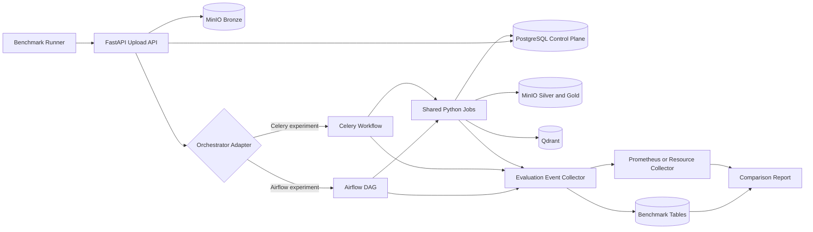
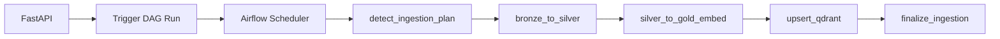
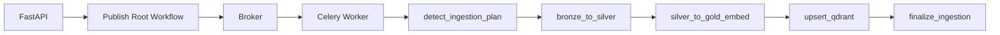

# RAGForge Airflow vs Celery Evaluation Framework

> [!abstract]
> This note defines a complete and repeatable evaluation system for comparing the current **Airflow-based RAGForge ingestion pipeline** with a future **Celery-based implementation**.
>
> The evaluation separates:
>
> 1. **Pure orchestration performance**
> 2. **Pipeline correctness and reliability**
> 3. **Real-provider behavior using Gemini and Groq free-tier APIs**
> 4. **RAG answer quality**
>
> The goal is not to prove that one tool is universally better. The goal is to identify which orchestrator is better for the actual RAGForge workload.

---

## 1. Evaluation objective

RAGForge currently uses Airflow to orchestrate durable file ingestion:

```text
FastAPI
  -> PostgreSQL control plane
  -> MinIO Bronze
  -> Airflow ingestion workflow
  -> Silver chunks
  -> Gold embeddings
  -> Qdrant indexing
  -> PostgreSQL final status
```

The planned comparison is:

```text
Current implementation:
FastAPI -> Airflow -> shared Python ingestion jobs

Future implementation:
FastAPI -> Celery -> the same shared Python ingestion jobs
```

The benchmark must answer:

> Which orchestrator gives RAGForge the best combination of correctness, reliability, latency, throughput, resource efficiency, observability, and maintainability?

The main decision KPI is:

```text
Correct indexed ingestions per minute
under the p95 latency objective
with zero lost, duplicated, or cross-tenant runs
```

---

## 2. Core fairness rule

> [!important]
> Airflow and Celery must execute the same business logic.

The following components must remain identical during the comparison:

- FastAPI endpoints
- Authentication and tenant validation
- PostgreSQL control-plane schema
- MinIO Bronze, Silver, and Gold storage
- Parsing code
- Chunker implementations
- Ingestion planner
- Embedding model
- Embedding batch sizes
- Qdrant indexing code
- Deterministic Qdrant point IDs
- Retry-safe artifact paths
- Redis event streaming
- Machine resources
- Worker limits
- Benchmark documents
- Environment variables
- Python version
- Dependency versions

Only the orchestration adapter should change:

```text
Airflow DAG and Airflow task runtime
                 versus
Celery workflow and Celery task runtime
```

### Invalid comparison

```text
Airflow + paragraph chunker + 4 workers
versus
Celery + semantic chunker + 8 workers
```

### Valid comparison

```text
Airflow + paragraph chunker + 4 workers
versus
Celery + paragraph chunker + 4 workers
```

---

## 3. Current logical ingestion stages

The orchestration-neutral workflow should contain the following stages:

```text
1. detect_ingestion_plan
2. bronze_to_silver
3. silver_to_gold_embed
4. upsert_qdrant
5. finalize_ingestion
```

### Stage responsibilities

| Stage | Responsibility |
|---|---|
| `detect_ingestion_plan` | Load durable run metadata and select profile, chunker, resource class, batch size, and maximum parallelism |
| `bronze_to_silver` | Read the Bronze object, parse content, chunk it, and write version-scoped Silver output |
| `silver_to_gold_embed` | Read Silver chunks, generate or reuse vectors, and write Gold output |
| `upsert_qdrant` | Replace the document version’s Qdrant points and PostgreSQL chunk lineage |
| `finalize_ingestion` | Verify boundaries, mark the run indexed, and update the active document version |

The orchestration layer must not contain parsing, chunking, embedding, or indexing business logic.

---

## 4. Shared job interface

Both Airflow and Celery should invoke the same Python functions.

```python
def detect_ingestion_plan(ingestion_run_id: str) -> dict:
    ...

def bronze_to_silver(ingestion_run_id: str, plan: dict) -> dict:
    ...

def silver_to_gold_embed(ingestion_run_id: str, plan: dict) -> dict:
    ...

def upsert_qdrant(ingestion_run_id: str, plan: dict) -> dict:
    ...

def finalize_ingestion(ingestion_run_id: str, plan: dict) -> dict:
    ...
```

Recommended design:

```text
backend/jobs/
  ingestion_plan.py
  bronze_to_silver.py
  silver_to_gold.py
  upsert_qdrant.py
  finalize_ingestion.py

backend/orchestrators/
  airflow_adapter.py
  celery_adapter.py
```

This prevents the future Celery migration from becoming a rewrite of the ingestion pipeline.

---

# 5. Evaluation architecture



---

# 6. Two evaluation tracks

A valid comparison requires two separate tracks.

## Track A — Controlled orchestration benchmark

Use a deterministic local provider or mock service.

Purpose:

- Isolate Airflow and Celery overhead
- Make runs reproducible
- Control latency
- Control error injection
- Avoid external quotas affecting results
- Avoid provider congestion changing results
- Compare retry behavior safely

This track should drive most of the final decision.

Recommended final weighting:

```text
70% controlled orchestration benchmark
20% real-provider behavior
10% RAG answer quality
```

## Track B — Real-provider validation

Use Gemini and Groq free-tier APIs for a smaller production-like validation.

Purpose:

- Measure real network behavior
- Measure HTTP 429 handling
- Measure provider timeouts
- Measure end-to-end latency
- Validate retry and backoff logic
- Validate token-budget controls
- Evaluate generated answer quality

> [!warning]
> Free-tier limits can change by model, project, account, and provider.
> Do not hard-code a quota value into the benchmark.
> Read the active quota from the provider dashboard before each experiment.

---

# 7. Metric categories and weights

| Category | Weight |
|---|---:|
| Correctness and data integrity | 25% |
| Performance and latency | 20% |
| Reliability and recovery | 20% |
| Scalability and concurrency | 15% |
| Resource efficiency | 10% |
| Operations and observability | 7% |
| Developer experience | 3% |
| **Total** | **100%** |

Correctness is also a hard gate. A fast system that loses or duplicates runs cannot win.

---

# 8. Hard gates

An orchestrator is disqualified if any required hard gate fails.

| Hard gate | Required result |
|---|---:|
| Lost submitted runs | 0 |
| Cross-tenant data leakage | 0 |
| Incorrect terminal statuses | 0 |
| Duplicate Qdrant points after retry | 0 |
| Missing version or run lineage | 0 |
| Artifact consistency | 100% |
| Final chunk-count consistency | 100% |
| Silent failures | 0 |
| Invalid status transitions | 0 |
| Unsupported permanent retry loops | 0 |

A run is valid only when all required conditions hold:

```text
PostgreSQL ingestion status = indexed
Document version status = indexed
Silver artifact exists
Gold artifact exists
PostgreSQL chunk rows exist
Qdrant points exist
Gold row count = PostgreSQL chunk count = Qdrant point count
Every point resolves to project, document, version, and ingestion run
Document current_version_id references the correct successful version
```

---

# 9. Correctness and data-integrity matrix

## 9.1 Metrics

| Metric | Definition | Measurement | Target |
|---|---|---|---:|
| Pipeline completion correctness | Indexed runs with valid outputs | Cross-system validator | 100% |
| Artifact consistency | Expected Bronze, Silver, and Gold objects exist | Path and hash validation | 100% |
| Chunk-count consistency | Gold rows equal PostgreSQL chunks and Qdrant points | Count comparison | 100% |
| Lineage completeness | Every indexed point resolves to durable metadata | Foreign-key and payload validation | 100% |
| Status-transition correctness | Run follows the lifecycle contract | Event sequence validation | 100% |
| Idempotency | Replaying the same run creates no duplicates | Repeated execution | 100% |
| Duplicate-execution rate | Stages executed more than required | Event-log analysis | 0% |
| Lost-job rate | Submitted jobs never reach a terminal state | Run-state analysis | 0% |
| Tenant isolation | One tenant cannot read or modify another tenant’s data | Security tests | 100% |
| Retry-result consistency | Retried run matches a clean run | Hash and ID comparison | 100% |
| Active-version correctness | Document points to latest successful version | Database validation | 100% |
| Partial-write protection | Status does not advance before output exists | Failure injection | 100% |

## 9.2 Integrity rate

```text
Integrity rate =
correctly indexed and validated runs
------------------------------------
total completed runs
```

## 9.3 Idempotency assertions

For the same `document_version_id`:

- Silver path remains version-scoped
- Gold path remains version-scoped
- Qdrant point IDs remain deterministic
- Old version points are replaced safely
- PostgreSQL chunk rows are replaced atomically
- The readable lineage key remains stable
- A retry does not create an additional document version
- A duplicate delivery does not create duplicate points

---

# 10. Performance and latency matrix

## 10.1 Required timestamps

For every run:

```text
request_received_at
upload_accepted_at
orchestrator_submitted_at
workflow_created_at
first_stage_dispatched_at
first_stage_started_at
silver_started_at
silver_completed_at
gold_started_at
gold_completed_at
qdrant_started_at
qdrant_completed_at
finalized_at
```

## 10.2 Metrics

| Metric | Definition | Formula |
|---|---|---|
| API acceptance latency | Upload request processing before HTTP 202 | `upload_accepted_at - request_received_at` |
| Submission latency | HTTP 202 to orchestrator acceptance | `orchestrator_submitted_at - upload_accepted_at` |
| Workflow creation latency | Orchestrator submission to workflow registration | `workflow_created_at - orchestrator_submitted_at` |
| Queue latency | Waiting before first execution | `first_stage_started_at - first_stage_dispatched_at` |
| Startup overhead | Worker/task initialization delay | `stage_started_at - stage_dispatched_at` |
| Bronze-to-Silver latency | Parse and chunk duration | `silver_completed_at - silver_started_at` |
| Silver-to-Gold latency | Embedding duration | `gold_completed_at - gold_started_at` |
| Qdrant indexing latency | Index replacement duration | `qdrant_completed_at - qdrant_started_at` |
| Finalization latency | Validation and status update duration | `finalized_at - qdrant_completed_at` |
| End-to-end latency | Upload accepted until indexed | `finalized_at - upload_accepted_at` |
| Throughput | Terminal runs per minute | `terminal_runs / elapsed_minutes` |
| Goodput | Correct indexed runs per minute | `validated_indexed_runs / elapsed_minutes` |

## 10.3 Required distributions

For each latency metric, record:

- p50
- p90
- p95
- p99
- maximum
- mean
- median
- standard deviation

Do not decide using only average latency.

## 10.4 Primary performance KPI

```text
Goodput =
correct indexed and validated runs
----------------------------------
benchmark duration in minutes
```

---

# 11. Reliability and recovery matrix

| Metric | Test | Measurement |
|---|---|---|
| Normal success rate | Standard benchmark | Successful indexed runs / submitted runs |
| Failure-detection latency | Force a stage failure | Recorded failure time − actual failure time |
| Failure-propagation correctness | Fail each stage | Correct run and version status |
| Retry success rate | Inject transient failures | Successful retries / retry attempts |
| Mean recovery time | Retry failed runs | Recovery completion − failure detection |
| Worker-crash recovery | Kill active worker | Work recovered, redelivered, or safely failed |
| Orchestrator-restart recovery | Restart Airflow or Celery components | No lost jobs |
| PostgreSQL-outage recovery | Stop database temporarily | No invalid final state |
| MinIO-outage recovery | Stop object storage | No status advancement before object exists |
| Qdrant-outage recovery | Stop Qdrant during indexing | Retry without duplicates |
| Internal API timeout recovery | Delay control-plane callbacks | Safe retry |
| Poison-task isolation | Submit permanently failing input | Other runs continue |
| Retry-storm resistance | Many transient failures | No system collapse |
| Dead-letter handling | Exhaust retries | Terminal diagnosable state |
| Stuck-run detection | Prevent callback completion | Run detected and reconciled |
| Duplicate-message safety | Redeliver the same task | Idempotent result |

## 11.1 Reliability formulas

```text
Success rate =
successfully indexed runs
-------------------------
submitted runs
```

```text
Recovery success rate =
failed runs recovered successfully
----------------------------------
retryable failed runs
```

```text
Mean recovery time =
sum(recovery completion - failure detection)
--------------------------------------------
number of recovered runs
```

---

# 12. Scalability and concurrency matrix

| Metric | Description |
|---|---|
| Maximum sustainable concurrency | Highest load before SLA or correctness failure |
| Goodput scaling | Correct runs per minute as workers increase |
| Scaling efficiency | Parallel efficiency relative to one worker |
| Queue growth rate | Rate at which waiting work accumulates |
| Queue drain time | Time to clear backlog after load stops |
| Worker utilization | Busy worker time / available worker time |
| Head-of-line blocking | Small jobs waiting behind large jobs |
| Workload fairness | Distribution of worker time across profiles |
| Tenant fairness | One tenant cannot monopolize processing |
| Backpressure effectiveness | Protection during overload |
| Memory scaling | Memory growth with concurrency |
| PostgreSQL pressure | Queries and connections per run |
| Scheduler or broker saturation | Point where orchestrator becomes bottleneck |
| Rate-limit amplification | Provider retries caused by excessive concurrency |
| Task prefetch impact | Effect of task reservation on fairness |

## 12.1 Scaling efficiency

```text
Scaling efficiency =
throughput with N workers
-------------------------
N × throughput with 1 worker
```

Example:

```text
1 worker  = 10 validated runs/minute
4 workers = 34 validated runs/minute

Scaling efficiency = 34 / (4 × 10) = 85%
```

## 12.2 Concurrency levels

Run at:

```text
1
5
10
25
50
100
```

concurrent ingestion submissions.

## 12.3 Worker levels

Run at:

```text
1
2
4
8
```

workers or equivalent execution slots.

---

# 13. Resource-efficiency matrix

| Metric | Unit | Collection |
|---|---:|---|
| Idle orchestrator memory | MB | Container metrics |
| Active orchestrator memory | MB | Container metrics |
| Worker peak memory | MB | Process/container metrics |
| Total CPU consumption | CPU-seconds | Prometheus or cgroups |
| CPU utilization | Percentage | Container metrics |
| Memory-time per run | GB-seconds/run | Integrated memory usage |
| CPU per correct run | CPU-seconds/run | CPU / validated runs |
| PostgreSQL queries per run | Count | DB statistics |
| PostgreSQL connections | Count | DB metrics |
| Broker operations per run | Count | Redis or RabbitMQ metrics |
| Network transfer per run | MB | Container statistics |
| Disk I/O per run | MB | Container statistics |
| Metadata storage growth | MB per 1,000 runs | Airflow DB or Celery backend |
| Cold-start overhead | Seconds | First run after clean start |
| Idle service count | Count | Deployment inventory |
| Energy proxy | CPU-seconds + memory-time | Derived metric |

## 13.1 CPU efficiency

```text
CPU efficiency =
correct completed runs
----------------------
total CPU-seconds
```

## 13.2 Memory efficiency

```text
Memory efficiency =
correct completed runs
----------------------
total GB-hours consumed
```

---

# 14. Operations and observability matrix

| Capability | Airflow | Celery |
|---|---|---|
| Workflow graph | Native DAG view | Canvas graph or custom representation |
| Run identity | DAG run ID | Root task or workflow ID |
| Stage identity | Task instance ID | Celery task ID |
| Retry visibility | Native task attempts | Task state and retry events |
| Dependency visibility | Native DAG dependencies | Chain/group/chord topology |
| Stage logs | Airflow task logs | Worker logs |
| Worker health | Airflow components | Celery worker inspection |
| Queue visibility | Executor/task state | Broker queue and Flower |
| Historical workflows | Airflow metadata DB | Result backend/custom tables |
| Status reconciliation | DAG state and callbacks | Signals and reconciliation process |
| Manual rerun | Task/run controls | Custom task/workflow controls |
| SLA monitoring | Native or external | Usually custom/external |
| Backfill support | Native strength | Custom workflow generation |
| Dynamic workflow support | Dynamic mapping | Canvas primitives |
| Local debugging | More services | Potentially simpler |
| Production debugging | Strong workflow UI | Depends on tooling |

## 14.1 Operational measurements

Measure:

- Mean time to diagnose
- Mean time to recover
- Number of manual recovery steps
- Number of services required
- Number of configuration variables
- Number of dashboards required
- Percentage of failures with a clear root cause
- Percentage of runs traceable across API, orchestrator, storage, DB, and Qdrant
- Time required to find the failing document and stage

## 14.2 Qualitative score

Use:

```text
1 = very poor
2 = poor
3 = acceptable
4 = good
5 = excellent
```

Every qualitative score must include written evidence.

---

# 15. Developer-experience matrix

| Metric | Measurement |
|---|---|
| Orchestration lines of code | Exclude shared business jobs |
| Boilerplate per stage | New code required for one stage |
| Integration-test complexity | Fixtures, services, setup time |
| Local startup complexity | Commands and containers |
| Time to add a new stage | Recorded engineering time |
| Time to change retry policy | Recorded engineering time |
| Time to add a new execution profile | Recorded engineering time |
| Test isolation | Ability to test without full stack |
| Coupling | Business logic imported from orchestrator |
| Type safety | Static-checking coverage |
| Maintainability | Team review score |
| Learning curve | Team score |
| Deployment complexity | Configuration and services |

---

# 16. Benchmark workload matrix

The workload must represent different ingestion profiles.

| ID | Document | Size | Chunker | Profile | Main pressure |
|---|---|---:|---|---|---|
| W1 | Plain text | 100 KB | `fixed_size` | throughput | Scheduler overhead |
| W2 | PDF | 1–5 MB | `paragraph` | throughput | Parsing and standard embedding |
| W3 | PDF | 10–25 MB | `sentence` | throughput | More chunks |
| W4 | Structured PDF | 10–25 MB | `hierarchical` | structured | Parent-child expansion |
| W5 | PDF | 10–25 MB | `semantic` | embedding-aware | Memory and embedding calls |
| W6 | Long document | 25–50 MB | `late_chunking` | embedding-aware | Reused precomputed vectors |
| W7 | Text/PDF | 1–5 MB | `proposition` | LLM-enriched | Provider limits and network |
| W8 | Mixed files | Mixed | Mixed | mixed | Production simulation |
| W9 | Invalid PDF | 1–5 MB | `paragraph` | failure | Permanent parsing failure |
| W10 | Duplicate content | Mixed | Any | idempotency | Duplicate protection |

---

# 17. Dataset design

Create a versioned benchmark dataset:

```text
evaluation/
  datasets/
    v1/
      small/
      medium/
      large/
      invalid/
      duplicates/
      manifests/
        documents.json
        expected_chunks.json
        expected_hashes.json
```

Each dataset manifest should record:

```json
{
  "dataset_version": "v1",
  "documents": [
    {
      "document_id": "benchmark-doc-001",
      "filename": "sample.pdf",
      "mime_type": "application/pdf",
      "size_bytes": 1048576,
      "sha256": "...",
      "expected_parser": "pdf",
      "supported_chunkers": [
        "fixed_size",
        "paragraph",
        "sentence"
      ]
    }
  ]
}
```

The benchmark dataset must not change between Airflow and Celery runs.

---

# 18. Experiment matrix

## Experiment E1 — Baseline overhead

```yaml
concurrency: 1
workers: 1
documents: 30
chunker: paragraph
provider: deterministic
failures: none
```

Measures:

- API-to-orchestrator submission
- Workflow creation
- Queue latency
- Task startup
- Idle and active memory
- End-to-end latency

## Experiment E2 — Throughput under concurrency

```yaml
concurrency_levels: [10, 25, 50, 100]
workers: 4
dataset: mixed-standard
provider: deterministic
failures: none
```

Measures:

- Goodput
- p95 queue latency
- p95 end-to-end latency
- Queue growth
- Maximum sustainable concurrency

## Experiment E3 — Worker scalability

```yaml
worker_levels: [1, 2, 4, 8]
concurrency: 100
dataset: mixed-standard
```

Measures:

- Scaling efficiency
- Worker utilization
- Database pressure
- Memory scaling

## Experiment E4 — Mixed workload fairness

```yaml
workload_distribution:
  lightweight: 40
  sentence: 20
  hierarchical: 15
  embedding_aware: 15
  proposition: 10
```

Measures:

- Head-of-line blocking
- Tenant fairness
- Profile fairness
- p95 latency by workload

## Experiment E5 — Transient failures

```yaml
parser_failure_percent: 0
minio_timeout_percent: 5
embedding_timeout_percent: 5
qdrant_timeout_percent: 5
internal_api_timeout_percent: 5
```

Measures:

- Retry behavior
- Recovery time
- Duplicate execution
- Retry amplification

## Experiment E6 — Permanent failures

```yaml
corrupted_documents_percent: 10
invalid_chunker_percent: 5
unsupported_file_percent: 5
```

Measures:

- Poison-task isolation
- Dead-letter behavior
- Permanent-error classification
- Unnecessary retries

## Experiment E7 — Infrastructure restart

Restart components while workflows are active:

- Airflow scheduler
- Airflow task execution component
- Celery worker
- Celery broker
- PostgreSQL
- MinIO
- Qdrant

Measures:

- Lost work
- Recovery behavior
- Duplicate delivery
- Stuck runs

## Experiment E8 — Long-running stability

```yaml
duration_hours: 4
arrival_pattern: variable
workload: mixed
provider: deterministic
```

Measures:

- Memory leaks
- Queue drift
- Metadata growth
- Worker degradation
- Stuck-run rate

## Experiment E9 — Real Gemini validation

```yaml
provider: gemini
questions: 30
orchestrators: [airflow, celery]
repetitions: 2
temperature: 0
```

Measures:

- Provider latency
- End-to-end latency
- HTTP 429 handling
- Timeout handling
- Token usage
- Duplicate provider requests

## Experiment E10 — Real Groq validation

```yaml
provider: groq
questions: 30
orchestrators: [airflow, celery]
repetitions: 2
temperature: 0
```

Measures the same metrics as E9.

## Experiment E11 — RAG quality evaluation

```yaml
questions: 50
reference_answers: true
retrieval_ground_truth: true
providers: [gemini, groq]
manual_review_percent: 20
```

Measures:

- Correctness
- Faithfulness
- Context precision
- Context recall
- Hallucination rate
- Citation support

---

# 19. Failure-injection matrix

| Scenario | Injection point | Expected result |
|---|---|---|
| Parser exception | Bronze-to-Silver | Run fails; no Silver completion |
| Corrupted PDF | Parser | Permanent failure; no retry loop |
| MinIO timeout | Artifact write | Status does not advance |
| Partial Silver write | Silver boundary | Incomplete artifact rejected |
| Embedding timeout | Silver-to-Gold | Controlled retry |
| Embedding worker crash | During batch | No accepted incomplete Gold |
| Qdrant unavailable | Indexing | Gold remains valid; indexing retries |
| PostgreSQL unavailable | Status write | Output recoverable; no false success |
| Internal API timeout | Callback | Idempotent retry |
| Worker killed | Any long stage | Safe redelivery or failure |
| Scheduler restarted | Active workflow | No lost runs |
| Broker restarted | Active Celery tasks | Recovery behavior recorded |
| Duplicate delivery | Any stage | No duplicate output |
| Rate-limit response | Proposition or generation | Exponential backoff |
| Provider timeout | LLM call | Retry within policy |
| Invalid profile | Planning | Fail before expensive processing |
| Disk pressure | Local worker | Clear error; no corrupted state |
| OOM kill | Embedding stage | Safe failure and retry policy |
| Stuck callback | Finalization | Reconciliation detects stale run |

---

# 20. Instrumentation model

The evaluation requires run-level and stage-level events.

## 20.1 `benchmark_experiments`

```sql
CREATE TABLE benchmark_experiments (
    id UUID PRIMARY KEY,
    name TEXT NOT NULL,
    orchestrator TEXT NOT NULL,
    git_commit TEXT NOT NULL,
    dataset_version TEXT NOT NULL,
    provider_mode TEXT NOT NULL,
    worker_count INTEGER NOT NULL,
    concurrency INTEGER NOT NULL,
    configuration_json JSONB NOT NULL,
    started_at TIMESTAMPTZ NOT NULL,
    finished_at TIMESTAMPTZ,
    status TEXT NOT NULL
);
```

## 20.2 `benchmark_runs`

```sql
CREATE TABLE benchmark_runs (
    id UUID PRIMARY KEY,
    experiment_id UUID NOT NULL
        REFERENCES benchmark_experiments(id),
    ingestion_run_id UUID NOT NULL,
    document_size_bytes BIGINT NOT NULL,
    document_type TEXT NOT NULL,
    chunker_id TEXT NOT NULL,
    profile TEXT NOT NULL,
    submitted_at TIMESTAMPTZ NOT NULL,
    queued_at TIMESTAMPTZ,
    started_at TIMESTAMPTZ,
    finished_at TIMESTAMPTZ,
    status TEXT NOT NULL,
    retry_count INTEGER NOT NULL DEFAULT 0,
    duplicate_execution_count INTEGER NOT NULL DEFAULT 0,
    error_class TEXT,
    integrity_valid BOOLEAN,
    integrity_error TEXT
);
```

## 20.3 `benchmark_stage_events`

```sql
CREATE TABLE benchmark_stage_events (
    id UUID PRIMARY KEY,
    experiment_id UUID NOT NULL
        REFERENCES benchmark_experiments(id),
    ingestion_run_id UUID NOT NULL,
    stage_name TEXT NOT NULL,
    attempt_number INTEGER NOT NULL,
    event_type TEXT NOT NULL,
    orchestrator_task_id TEXT,
    worker_id TEXT,
    event_timestamp TIMESTAMPTZ NOT NULL,
    duration_ms DOUBLE PRECISION,
    input_bytes BIGINT,
    output_bytes BIGINT,
    chunk_count INTEGER,
    cpu_seconds DOUBLE PRECISION,
    peak_memory_mb DOUBLE PRECISION,
    error_class TEXT,
    metadata_json JSONB NOT NULL DEFAULT '{}'::jsonb
);
```

## 20.4 `benchmark_resource_samples`

```sql
CREATE TABLE benchmark_resource_samples (
    id UUID PRIMARY KEY,
    experiment_id UUID NOT NULL
        REFERENCES benchmark_experiments(id),
    service_name TEXT NOT NULL,
    container_name TEXT,
    sample_timestamp TIMESTAMPTZ NOT NULL,
    cpu_percent DOUBLE PRECISION,
    memory_mb DOUBLE PRECISION,
    network_rx_bytes BIGINT,
    network_tx_bytes BIGINT,
    disk_read_bytes BIGINT,
    disk_write_bytes BIGINT
);
```

## 20.5 `benchmark_provider_calls`

```sql
CREATE TABLE benchmark_provider_calls (
    id UUID PRIMARY KEY,
    experiment_id UUID NOT NULL
        REFERENCES benchmark_experiments(id),
    ingestion_run_id UUID,
    query_id UUID,
    orchestrator TEXT NOT NULL,
    provider TEXT NOT NULL,
    model TEXT NOT NULL,
    purpose TEXT NOT NULL,
    prompt_hash TEXT NOT NULL,
    attempt_number INTEGER NOT NULL,
    started_at TIMESTAMPTZ NOT NULL,
    finished_at TIMESTAMPTZ,
    input_tokens INTEGER,
    output_tokens INTEGER,
    status_code INTEGER,
    provider_latency_ms DOUBLE PRECISION,
    total_operation_latency_ms DOUBLE PRECISION,
    rate_limited BOOLEAN NOT NULL DEFAULT FALSE,
    timed_out BOOLEAN NOT NULL DEFAULT FALSE,
    error_class TEXT
);
```

## 20.6 `benchmark_quality_scores`

```sql
CREATE TABLE benchmark_quality_scores (
    id UUID PRIMARY KEY,
    experiment_id UUID NOT NULL
        REFERENCES benchmark_experiments(id),
    query_id UUID NOT NULL,
    provider TEXT NOT NULL,
    model TEXT NOT NULL,
    answer_correctness DOUBLE PRECISION,
    faithfulness DOUBLE PRECISION,
    answer_relevance DOUBLE PRECISION,
    context_precision DOUBLE PRECISION,
    context_recall DOUBLE PRECISION,
    citation_correctness DOUBLE PRECISION,
    hallucination_detected BOOLEAN,
    judge_type TEXT NOT NULL,
    reviewer_notes TEXT
);
```

---

# 21. Common instrumentation wrapper

Both orchestrators must call the same wrapper.

```python
from collections.abc import Callable
from time import perf_counter
from typing import Any


def execute_instrumented_stage(
    *,
    experiment_id: str,
    ingestion_run_id: str,
    stage_name: str,
    attempt: int,
    worker_id: str,
    function: Callable[..., Any],
    **kwargs: Any,
) -> Any:
    record_stage_event(
        experiment_id=experiment_id,
        ingestion_run_id=ingestion_run_id,
        stage_name=stage_name,
        attempt_number=attempt,
        event_type="started",
        worker_id=worker_id,
    )

    started = perf_counter()

    try:
        result = function(**kwargs)
        duration_ms = (perf_counter() - started) * 1000

        record_stage_event(
            experiment_id=experiment_id,
            ingestion_run_id=ingestion_run_id,
            stage_name=stage_name,
            attempt_number=attempt,
            event_type="completed",
            worker_id=worker_id,
            duration_ms=duration_ms,
            metadata_json=extract_stage_metrics(result),
        )

        return result

    except Exception as exc:
        duration_ms = (perf_counter() - started) * 1000

        record_stage_event(
            experiment_id=experiment_id,
            ingestion_run_id=ingestion_run_id,
            stage_name=stage_name,
            attempt_number=attempt,
            event_type="failed",
            worker_id=worker_id,
            duration_ms=duration_ms,
            error_class=type(exc).__name__,
        )
        raise
```

---

# 22. Airflow workflow under evaluation



Collect:

- FastAPI submission time
- Airflow authentication time
- DAG-run creation time
- Scheduler queue time
- Task-instance queue time
- Worker/task startup time
- Task execution time
- Inter-task delay
- XCom or task-output overhead
- Status-callback time
- Metadata database writes
- Scheduler CPU and memory
- DAG processor CPU and memory
- API server CPU and memory
- Triggerer CPU and memory when active

---

# 23. Celery workflow under evaluation

Equivalent workflow:

```python
from celery import chain


def build_ingestion_workflow(
    ingestion_run_id: str,
    experiment_id: str,
):
    return chain(
        detect_ingestion_plan_task.s(
            ingestion_run_id=ingestion_run_id,
            experiment_id=experiment_id,
        ),
        bronze_to_silver_task.s(),
        silver_to_gold_task.s(),
        upsert_qdrant_task.s(),
        finalize_ingestion_task.s(),
    )
```



Collect:

- FastAPI publication time
- Message serialization time
- Broker queue time
- Worker pickup time
- Task startup time
- Chain transition delay
- Task execution time
- Result-backend overhead
- Retry scheduling delay
- Broker memory and CPU
- Worker memory and CPU
- Result-backend storage growth
- Prefetch behavior
- Task acknowledgement behavior

> [!important]
> Do not compare five Airflow tasks with one monolithic Celery task.
> Both orchestrators must use the same logical stage boundaries.

---

# 24. Deterministic provider for controlled tests

The deterministic provider should support:

- Fixed responses
- Configurable latency
- Configurable output length
- Fixed token counts
- HTTP 429 simulation
- HTTP 500 simulation
- Timeout simulation
- Connection-reset simulation
- Deterministic request IDs
- Configurable failure percentage
- Seeded behavior

Example configuration:

```yaml
provider_mode: deterministic
latency_ms: 500
input_tokens: 1000
output_tokens: 200
failure_seed: 42
rate_limit_percent: 5
timeout_percent: 5
server_error_percent: 2
```

Example provider logic:

```python
from dataclasses import dataclass
import hashlib
import time


@dataclass(frozen=True)
class MockProviderConfig:
    latency_ms: int = 500
    input_tokens: int = 1000
    output_tokens: int = 200


class DeterministicProvider:
    def __init__(self, config: MockProviderConfig) -> None:
        self.config = config

    def generate(self, prompt: str) -> dict:
        time.sleep(self.config.latency_ms / 1000)

        prompt_hash = hashlib.sha256(
            prompt.encode("utf-8")
        ).hexdigest()

        return {
            "text": f"deterministic-response-{prompt_hash[:12]}",
            "input_tokens": self.config.input_tokens,
            "output_tokens": self.config.output_tokens,
        }
```

---

# 25. Gemini and Groq free-tier evaluation strategy

> [!note]
> Use the provider name **Groq** for the API platform.
> “Grok” is a different product name.

Free-tier APIs are suitable for:

- Small end-to-end validation
- Rate-limit behavior
- Timeout behavior
- Retry validation
- Token tracking
- Answer-quality evaluation
- LLM-as-judge experiments

They are not suitable as the only source of truth for:

- Airflow vs Celery scheduler overhead
- Stable throughput comparisons
- Reproducible latency comparisons
- Maximum concurrency testing
- Large failure-injection experiments

External provider behavior can vary because of:

- Rate limits
- Daily quotas
- Per-minute quotas
- Provider load
- Network routing
- Model version changes
- Model warm-up
- Account-specific limits
- Output variability

---

# 26. Real-provider fairness rules

When comparing orchestrators, keep identical:

- Provider
- Model
- Prompt template
- Retrieved chunks
- Context order
- Temperature
- Maximum output tokens
- Timeout
- Retry count
- Backoff strategy
- Concurrency
- Question dataset
- Provider account/project
- Experiment time window when possible

Valid:

```text
Airflow + Gemini model X
Celery  + Gemini model X
```

Valid:

```text
Airflow + Groq-hosted model Y
Celery  + Groq-hosted model Y
```

Invalid:

```text
Airflow + Gemini
Celery  + Groq
```

The invalid case compares providers rather than orchestrators.

---

# 27. Token-budget protection

Create a budget guard before executing real API calls.

```python
from dataclasses import dataclass


@dataclass
class EvaluationBudget:
    max_requests: int
    max_input_tokens: int
    max_output_tokens: int

    requests: int = 0
    input_tokens: int = 0
    output_tokens: int = 0

    def can_execute(
        self,
        *,
        estimated_input_tokens: int,
        estimated_output_tokens: int,
    ) -> bool:
        return (
            self.requests + 1 <= self.max_requests
            and self.input_tokens + estimated_input_tokens
            <= self.max_input_tokens
            and self.output_tokens + estimated_output_tokens
            <= self.max_output_tokens
        )

    def record(
        self,
        *,
        input_tokens: int,
        output_tokens: int,
    ) -> None:
        self.requests += 1
        self.input_tokens += input_tokens
        self.output_tokens += output_tokens
```

Additional controls:

- Maximum requests per experiment
- Maximum retries per question
- Maximum provider calls per ingestion
- Maximum input tokens
- Maximum output tokens
- Maximum context chunks
- Maximum concurrent provider calls
- Stop experiment before quota exhaustion
- Cache deterministic judge results by prompt hash
- Do not retry permanent errors
- Use exponential backoff with jitter
- Record every attempt

---

# 28. Proposition chunking rule

Proposition chunking uses an external LLM and must be evaluated separately.

## Core orchestration benchmark

Use:

- `fixed_size`
- `paragraph`
- `sentence`
- `hierarchical`
- `semantic`
- `late_chunking`

This measures orchestration without an external LLM dependency.

## Production-like LLM ingestion benchmark

Use:

- `proposition`

This measures:

- Orchestrator behavior
- Provider rate limits
- Network latency
- Retry behavior
- Token cost pressure
- Worker blocking
- Backoff scheduling

Never mix proposition-heavy workloads into the primary orchestration score without reporting them separately.

---

# 29. RAG quality matrix

| Metric | Meaning |
|---|---|
| Answer correctness | Answer matches the reference or expected facts |
| Faithfulness | Claims are supported by retrieved context |
| Answer relevance | Answer addresses the question |
| Context precision | Retrieved chunks are relevant |
| Context recall | Required evidence was retrieved |
| Citation correctness | Cited chunk supports the associated claim |
| Hallucination rate | Unsupported claims appear |
| No-answer accuracy | System refuses when evidence is absent |
| Retrieval rank quality | Relevant chunks appear early |
| Source diversity | Answer uses appropriate evidence across documents |

## 29.1 Retrieval metrics

When ground-truth relevant chunks are available:

```text
Precision@k
Recall@k
Hit Rate@k
Mean Reciprocal Rank
Normalized Discounted Cumulative Gain
```

## 29.2 Generation metrics

Use:

- Exact match where appropriate
- Token-level F1 where appropriate
- Semantic similarity
- Faithfulness judge
- Human review
- Citation support validation

## 29.3 LLM judge strategy

Recommended:

```text
Deterministic metrics
+
LLM judge
+
Manual review of 10–20% of outputs
```

Prefer cross-provider judging:

```text
Gemini generates -> Groq-hosted model judges
Groq-hosted model generates -> Gemini judges
```

Reduce judge bias by:

- Randomizing answer order
- Hiding orchestrator identity
- Using the same rubric
- Using deterministic temperature where supported
- Repeating a small subset
- Measuring judge agreement
- Manually reviewing disagreements

---

# 30. Provider-performance metrics

For each Gemini or Groq request, collect:

| Metric | Meaning |
|---|---|
| Provider latency p50/p95/p99 | Time spent waiting for provider |
| Time to first token | Streaming responsiveness |
| Input tokens | Prompt and context size |
| Output tokens | Generated answer size |
| Tokens per second | Generation speed |
| HTTP 429 rate | Rate-limit pressure |
| Timeout rate | Provider reliability |
| HTTP 5xx rate | Provider-side failures |
| Retry count | Additional attempts |
| Duplicate request count | Wasted provider calls |
| Successful calls per minute | Effective provider throughput |
| Backoff delay | Time waiting before retries |
| Worker blocked time | Worker time unavailable during calls |

---

# 31. Retry policy comparison

Use equivalent policies.

Example conceptual policy:

```yaml
max_attempts: 4
initial_backoff_seconds: 2
backoff_multiplier: 2
maximum_backoff_seconds: 60
jitter: true
retryable_errors:
  - timeout
  - connection_reset
  - http_429
  - http_500
  - http_502
  - http_503
  - http_504
permanent_errors:
  - invalid_document
  - unsupported_type
  - invalid_chunker
  - authentication_error
```

Compare:

- Actual attempt count
- Retry delay
- Worker occupancy during retry
- Duplicate provider calls
- Final error classification
- Recovery after orchestrator restart

---

# 32. Status lifecycle validation

Expected ingestion lifecycle:

```text
landed
  -> queued
  -> running
  -> silver_completed
  -> gold_completed
  -> indexed
```

Terminal alternatives:

```text
failed
cancelled
```

The evaluator must reject:

```text
landed -> indexed
running -> queued
failed -> indexed without retry/reset
gold_completed -> silver_completed
indexed -> running
```

Recommended validation:

```python
ALLOWED_TRANSITIONS = {
    "landed": {"queued", "failed", "cancelled"},
    "queued": {"running", "failed", "cancelled"},
    "running": {"silver_completed", "failed", "cancelled"},
    "silver_completed": {"gold_completed", "failed", "cancelled"},
    "gold_completed": {"indexed", "failed", "cancelled"},
    "indexed": set(),
    "failed": {"queued"},
    "cancelled": set(),
}
```

---

# 33. Stuck-run reconciliation

Both implementations require a reconciliation process.

A run is potentially stuck when:

```text
status is non-terminal
AND
last stage heartbeat is older than threshold
AND
no active orchestrator task exists
```

Reconciliation should:

1. Read durable PostgreSQL state
2. Check orchestrator state
3. Check artifact existence
4. Check Qdrant lineage
5. Determine the last valid boundary
6. Retry safely or mark failed
7. Record the reconciliation action

Measure:

- Number of stuck runs
- Detection latency
- Recovery success
- False-positive reconciliation
- Manual intervention rate

---

# 34. Resource collection

Recommended sources:

```text
Docker / cgroups
Prometheus
PostgreSQL statistics
Redis metrics
RabbitMQ metrics when used
Airflow metrics
Celery events
Flower
Application instrumentation
```

Sample interval:

```text
1–5 seconds during load tests
```

Do not sample too slowly for short tasks.

Collect per service:

- CPU
- Memory
- Network receive/transmit
- Disk read/write
- Restart count
- Open connections
- Queue length
- Active tasks
- Reserved tasks
- Failed tasks
- Retry tasks

---

# 35. Benchmark execution process

## Phase 1 — Preparation

- [ ] Freeze a Git commit
- [ ] Freeze dependency versions
- [ ] Create dataset version
- [ ] Validate all dataset hashes
- [ ] Reset PostgreSQL benchmark schema
- [ ] Reset MinIO benchmark buckets
- [ ] Reset Qdrant benchmark collections
- [ ] Reset Redis or broker queues
- [ ] Set identical CPU and memory limits
- [ ] Disable unrelated background workloads
- [ ] Record machine specifications
- [ ] Record Docker version
- [ ] Record Python version
- [ ] Record provider and model names
- [ ] Record quota limits visible before real-provider tests

## Phase 2 — Baseline validation

- [ ] Run one document through Airflow
- [ ] Validate all boundaries
- [ ] Run the same document through Celery
- [ ] Validate all boundaries
- [ ] Compare artifact hashes
- [ ] Compare chunk counts
- [ ] Compare Qdrant payloads
- [ ] Compare status sequences
- [ ] Confirm deterministic point IDs

## Phase 3 — Controlled benchmark

- [ ] Run E1 baseline
- [ ] Run E2 concurrency
- [ ] Run E3 worker scaling
- [ ] Run E4 mixed workloads
- [ ] Run E5 transient failures
- [ ] Run E6 permanent failures
- [ ] Run E7 restarts
- [ ] Run E8 long-running stability

## Phase 4 — Real-provider validation

- [ ] Confirm remaining Gemini quota
- [ ] Confirm remaining Groq quota
- [ ] Configure request budget
- [ ] Use the same questions
- [ ] Use the same model settings
- [ ] Run Airflow and Celery in balanced order
- [ ] Record all provider attempts
- [ ] Stop before quota exhaustion
- [ ] Review 429 and timeout behavior

## Phase 5 — Quality evaluation

- [ ] Evaluate retrieval metrics
- [ ] Evaluate answer correctness
- [ ] Evaluate faithfulness
- [ ] Evaluate citation support
- [ ] Run cross-provider judge
- [ ] Manually inspect sample
- [ ] Record judge disagreements

## Phase 6 — Reporting

- [ ] Apply hard gates
- [ ] Calculate raw metrics
- [ ] Calculate percentile metrics
- [ ] Normalize category scores
- [ ] Apply category weights
- [ ] Document qualitative evidence
- [ ] Record limitations
- [ ] Produce final recommendation

---

# 36. Repetition and randomization

To reduce noise:

- Repeat controlled experiments at least 3 times
- Use 5 repetitions for small baseline tests
- Alternate execution order

Example:

```text
Round 1: Airflow -> Celery
Round 2: Celery -> Airflow
Round 3: Airflow -> Celery
```

Randomize document order with a fixed seed.

Record:

```text
random_seed
experiment_round
execution_order
```

Use the median across repetitions for the primary score and preserve all raw data.

---

# 37. Statistical reporting

For each metric report:

- Sample size
- Mean
- Median
- Standard deviation
- p50
- p90
- p95
- p99
- Minimum
- Maximum
- Confidence interval where useful

Do not claim that a difference is meaningful when it is smaller than normal run-to-run variation.

Suggested practical significance thresholds:

```text
Latency improvement: at least 10%
Goodput improvement: at least 10%
Memory improvement: at least 15%
CPU improvement: at least 10%
Failure-rate change: any regression is important
Correctness regression: unacceptable
```

---

# 38. Scoring method

## 38.1 Lower is better

For latency, memory, CPU, failure rate, and queue time:

```text
score = best measured value / current measured value × 100
```

## 38.2 Higher is better

For success rate, goodput, recovery rate, and scaling efficiency:

```text
score = current measured value / best measured value × 100
```

Cap at 100.

## 38.3 Weighted score

```text
Final score =
correctness × 0.25
+ performance × 0.20
+ reliability × 0.20
+ scalability × 0.15
+ resource efficiency × 0.10
+ operations × 0.07
+ developer experience × 0.03
```

## 38.4 Example

```text
Airflow p95 latency = 40 seconds
Celery p95 latency  = 28 seconds

Airflow latency score = 28 / 40 × 100 = 70
Celery latency score  = 28 / 28 × 100 = 100
```

---

# 39. Final comparison table

| Category | Airflow | Celery | Evidence | Winner |
|---|---:|---:|---|---|
| Correctness | /100 | /100 | | |
| Performance | /100 | /100 | | |
| Reliability | /100 | /100 | | |
| Scalability | /100 | /100 | | |
| Resource efficiency | /100 | /100 | | |
| Operations | /100 | /100 | | |
| Developer experience | /100 | /100 | | |
| **Weighted total** | **/100** | **/100** | | |

---

# 40. Final raw KPI table

| KPI | Airflow | Celery |
|---|---:|---:|
| p50 queue latency | | |
| p95 queue latency | | |
| p99 queue latency | | |
| p50 end-to-end latency | | |
| p95 end-to-end latency | | |
| p99 end-to-end latency | | |
| Correct runs per minute | | |
| Success rate | | |
| Recovery success rate | | |
| Mean recovery time | | |
| Duplicate execution rate | | |
| Lost-job rate | | |
| Peak orchestrator memory | | |
| Peak worker memory | | |
| CPU-seconds per correct run | | |
| Maximum sustainable concurrency | | |
| Scaling efficiency at 4 workers | | |
| Scaling efficiency at 8 workers | | |
| PostgreSQL queries per run | | |
| Provider duplicate-call rate | | |
| Mean time to diagnose | | |
| Manual recovery rate | | |

---

# 41. Decision rules

## Choose Celery when

- All correctness hard gates pass
- Queue latency is materially lower
- Goodput is materially higher
- CPU and memory efficiency are better
- Worker and broker recovery is safe
- Retry behavior does not create duplicate processing
- Operational visibility is sufficient
- The custom orchestration code remains maintainable
- Long-running tasks do not block the worker pool unfairly
- Rate-limit backoff does not consume all workers

## Choose Airflow when

- Workflow auditability is a primary requirement
- Complex dependencies and backfills are common
- Native run history and task-level debugging matter strongly
- Operational recovery is easier
- Celery requires too much custom state management
- Celery’s result and workflow tracking are insufficient
- The performance improvement is too small to justify migration
- Airflow overhead is acceptable at the required scale

## Consider a hybrid design when

- Airflow is useful for scheduled, auditable batch workflows
- Celery is useful for user-triggered low-latency ingestion
- Shared jobs remain orchestrator-neutral
- PostgreSQL remains the durable source of truth

Possible hybrid:

```text
FastAPI user uploads -> Celery
Scheduled reindexing -> Airflow
Evaluation backfills -> Airflow
Small asynchronous application jobs -> Celery
```

---

# 42. Expected risks

## Airflow risks

- Higher idle resource usage
- Scheduler overhead
- More supporting services
- Metadata database growth
- Higher startup latency for short tasks
- Local development complexity

## Celery risks

- Custom workflow observability
- Custom reconciliation
- Broker dependency
- Duplicate delivery
- Complex chain error propagation
- Retry-state synchronization
- Long-running task worker blocking
- Result-backend growth
- Prefetch unfairness

## Shared risks

- Qdrant and PostgreSQL are not one atomic transaction
- Provider rate limits can distort results
- Large embeddings can cause OOM failures
- External network variance affects end-to-end latency
- Incorrect instrumentation can produce misleading conclusions
- Benchmark datasets may not represent production traffic

---

# 43. Privacy and provider safety

For free-tier real-provider experiments:

- Use public, synthetic, or anonymized documents
- Do not send confidential customer documents
- Review current provider data-use terms
- Avoid personal data
- Avoid secrets and credentials
- Hash prompts in benchmark logs where possible
- Store full prompts only when necessary
- Restrict access to evaluation tables
- Set retention rules for provider-call logs

---

# 44. Recommended project structure

```text
evaluation/
  README.md
  configs/
    baseline.yaml
    concurrency.yaml
    failures.yaml
    real_gemini.yaml
    real_groq.yaml
  datasets/
    v1/
  runners/
    run_experiment.py
    submit_load.py
    inject_failures.py
  collectors/
    stage_events.py
    resources.py
    provider_calls.py
  validators/
    artifacts.py
    lineage.py
    statuses.py
    qdrant.py
  reports/
    generate_report.py
    templates/
  providers/
    deterministic.py
    gemini.py
    groq.py
  orchestrators/
    airflow_client.py
    celery_client.py
  sql/
    benchmark_schema.sql
  tests/
    test_integrity.py
    test_idempotency.py
    test_failure_recovery.py
```

---

# 45. Minimum viable evaluation implementation

Start with:

1. Add `benchmark_experiments`
2. Add `benchmark_runs`
3. Add `benchmark_stage_events`
4. Add the common instrumentation wrapper
5. Implement deterministic provider
6. Run one Airflow baseline
7. Implement Celery using the same jobs
8. Run one Celery baseline
9. Validate integrity
10. Add concurrency tests
11. Add failure injection
12. Add resource collection
13. Add small Gemini and Groq validations
14. Generate the weighted report

---

# 46. Definition of done

The evaluation system is complete when:

- [ ] Both orchestrators execute the same shared jobs
- [ ] All experiment configurations are versioned
- [ ] Dataset hashes are versioned
- [ ] Stage-level events are stored
- [ ] Resource metrics are stored
- [ ] Provider calls are stored
- [ ] Integrity is validated automatically
- [ ] Duplicate execution is detected
- [ ] Lost and stuck runs are detected
- [ ] Failure-injection tests are repeatable
- [ ] Controlled experiments are repeatable
- [ ] Real-provider tests use budgets
- [ ] RAG quality is evaluated
- [ ] Hard gates are applied
- [ ] Weighted scores are generated
- [ ] Final limitations are documented
- [ ] A migration decision is supported by evidence

---

# 47. Final recommendation template

> [!summary]
> **Recommended orchestrator:** Airflow / Celery / Hybrid
>
> **Reason:**  
> Summarize the strongest evidence from correctness, p95 latency, goodput, recovery, resource usage, and operational complexity.
>
> **Hard-gate result:** Pass / Fail
>
> **Controlled benchmark winner:**  
> Airflow / Celery
>
> **Real-provider validation winner:**  
> Airflow / Celery / No meaningful difference
>
> **RAG quality difference:**  
> Expected to be none when business logic and provider settings are identical.
>
> **Migration decision:**  
> Migrate / Keep Airflow / Use hybrid / Collect more data
>
> **Main remaining risk:**  
> Describe the highest unresolved operational or correctness risk.

---

# 48. Related Obsidian notes

Suggested future notes:

- [[RAGForge Architecture]]
- [[RAGForge Control Plane]]
- [[RAGForge Ingestion Lifecycle]]
- [[Airflow Orchestration Design]]
- [[Celery Orchestration Design]]
- [[RAG Evaluation Metrics]]
- [[RAGForge Failure Recovery]]
- [[RAGForge Observability]]
- [[RAGForge Benchmark Results]]

---

# 49. Source context

This framework is designed for the RAGForge architecture in which:

- FastAPI accepts authenticated ingestion requests
- PostgreSQL stores durable control-plane metadata
- MinIO stores Bronze, Silver, and Gold artifacts
- Airflow currently orchestrates file ingestion
- Qdrant stores dense and sparse vectors
- Redis supports cache and short-lived event delivery
- The ingestion planner selects execution profiles
- Deterministic IDs support safe retries and version rebuilds
- Gemini and Groq can be used for generation or LLM-enriched processing

The benchmark intentionally preserves these boundaries while replacing only the orchestration layer.
